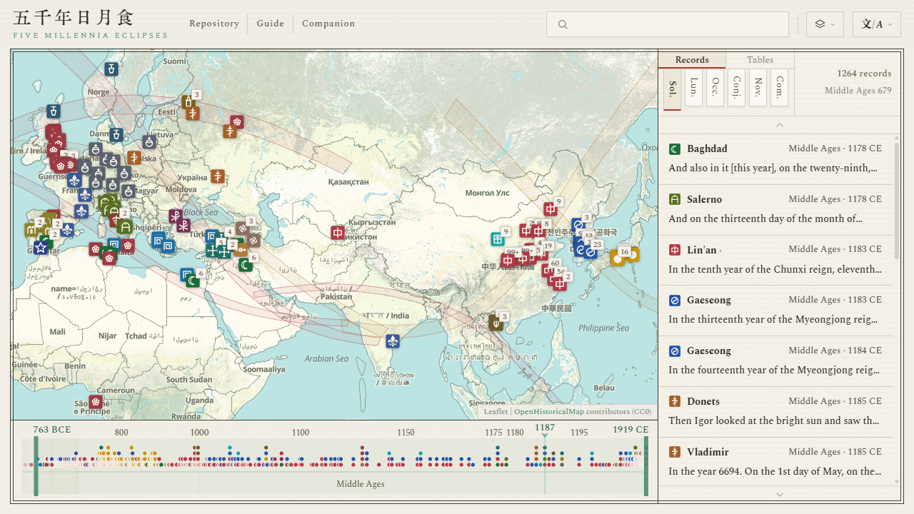

#  Five Millennia of Eclipses

[简体中文](../zh-Hans/README.md) · [繁體中文](../zh-Hant/README.md) · **English** · [Français](../fr/README.md) · [Español](../es/README.md) · [Italiano](../it/README.md) · [日本語](../ja/README.md)

  

**Site**: <https://higashimado.github.io/FiveMillenniaEclipses/>

Five Millennia of Eclipses is a historical atlas of astronomical records. It gathers the accounts written down in every age and returns each one to the day and the place that account names. Solar and lunar eclipses form its core; occultations, conjunctions, guest stars and comets complete six classes of phenomena, and the corpus now holds more than twelve thousand entries. Every datable record is tied to the actual event recovered by modern computation, and all of them are ranged along a single timeline spanning five millennia. Who saw an event, where it was seen, which calendar dated it and what name it was given are legible at a glance, across cultures and across centuries.

## Records

The corpus holds 12,026 records from 26 civilizations. Each record stores the original text, its translations and an editorial note as separate fields. The source files live under [data/](../data/):

| File | Contents |
|---|---|
| [`data/records/schema.json`](../data/records/schema.json) | Field definitions |
| [`data/records/manifest.json`](../data/records/manifest.json) | File inventory |
| [`data/records/sources.json`](../data/records/sources.json) | Bibliography |
| `data/records/<phenomenon>/<civilization>.jsonl` | The records themselves |

### East Asia

East Asia supplies 11,804 records, 98.2% of the corpus, running from 2137 BCE to 1911 CE. The Chinese branch draws on sixteen of the Twenty-Four Histories together with the Draft History of Qing, taking their treatises on astronomy, on the five phases and on the calendar along with their basic annals. It also draws on the classics (Shangshu, Shijing, [Chunqiu](https://zh.wikisource.org/wiki/春秋經) and [Zuozhuan](https://zh.wikisource.org/wiki/春秋左氏傳)), on the Yinxu oracle bones, and on a number of miscellanies and poems. Most texts follow the punctuated editions at [Wikisource](https://zh.wikisource.org/).

Twenty-three principal sources account for 11,666 records, 98.8% of the East Asian branch, ordered here by the earliest year each one records:

| Source | Period | Sol. | Lun. | Occ. | Conj. | Nov. | Com. | Records |
|---|---|---:|---:|---:|---:|---:|---:|---:|
| [Book of Han, Treatise on the Five Phases](https://zh.wikisource.org/wiki/%E6%BC%A2%E6%9B%B8/%E5%8D%B7027) | 205 BCE – 2 CE | 45 |  |  |  |  |  | 45 |
| [Samguk sagi](https://zh.wikisource.org/wiki/%E4%B8%89%E5%9C%8B%E5%8F%B2%E8%A8%98/%E5%8D%B701) | 54 BCE – 911 CE | 44 |  |  |  | 3 | 7 | 54 |
| [Book of Later Han, Treatise on the Five Phases VI](https://zh.wikisource.org/wiki/%E5%BE%8C%E6%BC%A2%E6%9B%B8/%E5%8D%B7108) | 26–219 | 65 |  |  |  |  |  | 65 |
| [Book of Later Han, Treatise on Astronomy](https://zh.wikisource.org/wiki/%E5%BE%8C%E6%BC%A2%E6%9B%B8/%E5%8D%B7102) | 55–213 | 1 |  |  |  | 11 | 17 | 29 |
| [Book of Song, Treatise on the Five Phases](https://zh.wikisource.org/wiki/%E5%AE%8B%E6%9B%B8/%E5%8D%B734) | 221–479 | 73 |  |  |  |  |  | 73 |
| [Book of Jin, Treatise on Astronomy](https://zh.wikisource.org/wiki/%E6%99%89%E6%9B%B8/%E5%8D%B7013) | 222–418 |  | 1 |  |  | 6 | 47 | 54 |
| [Book of Wei, Treatise on Celestial Phenomena](https://zh.wikisource.org/wiki/%E9%AD%8F%E6%9B%B8/%E5%8D%B7105%E4%B9%8B%E4%B8%80) | 400–549 | 32 | 36 |  |  | 3 | 23 | 94 |
| [Book of Sui, Treatise on Astronomy](https://zh.wikisource.org/wiki/%E9%9A%8B%E6%9B%B8/%E5%8D%B721) | 502–617 | 11 | 3 | 175 | 12 | 4 | 14 | 219 |
| [New Book of Tang, Treatise on Astronomy](https://zh.wikisource.org/wiki/%E6%96%B0%E5%94%90%E6%9B%B8/%E5%8D%B7033) | 618–906 | 90 |  | 389 | 1 | 6 | 48 | 534 |
| [Old Book of Tang, Treatise on Astronomy](https://zh.wikisource.org/wiki/%E8%88%8A%E5%94%90%E6%9B%B8/%E5%8D%B736) | 626–839 | 1 | 1 |  |  |  | 18 | 20 |
| [Rikkokushi](https://zh.wikisource.org/wiki/%E6%97%A5%E6%9C%AC%E6%9B%B8%E7%B4%80/%E5%8D%B7%E7%AC%AC%E4%B8%89%E5%8D%81) | 680–887 | 97 | 4 |  |  |  |  | 101 |
| [Fusō ryakki](https://zh.wikisource.org/wiki/%E6%89%B6%E6%A1%91%E7%95%A5%E8%A8%98/%E7%AC%AC023); Hyakurenshō; Azuma kagami | 898–1265 | 20 |  |  |  |  |  | 20 |
| [Old History of the Five Dynasties, Treatise on Astronomy](https://zh.wikisource.org/wiki/%E8%88%8A%E4%BA%94%E4%BB%A3%E5%8F%B2/%E5%8D%B7139) | 911–958 | 9 | 11 |  |  |  | 6 | 26 |
| [History of Song, Treatise on Astronomy](https://zh.wikisource.org/wiki/%E5%AE%8B%E5%8F%B2/%E5%8D%B7053) | 960–1275 | 121 | 149 | 4,819 |  | 17 | 21 | 5,127 |
| [Đại Việt sử ký toàn thư](https://zh.wikisource.org/wiki/%E5%A4%A7%E8%B6%8A%E5%8F%B2%E8%A8%98%E5%85%A8%E6%9B%B8/%E6%9C%AC%E7%B4%80%E5%8D%B7%E4%B9%8B%E4%BA%94) | 993–1774 | 46 | 32 |  |  |  |  | 78 |
| [Goryeosa, Treatise on Astronomy](https://zh.wikisource.org/wiki/%E9%AB%98%E9%BA%97%E5%8F%B2/%E5%8D%B7%E5%9B%9B%E5%8D%81%E5%85%AB) | 1012–1393 | 119 | 97 | 1,911 | 4 | 3 | 15 | 2,149 |
| [History of Jin, Treatise on Astronomy](https://zh.wikisource.org/wiki/%E9%87%91%E5%8F%B2/%E5%8D%B720) | 1120–1232 | 8 | 25 | 209 | 4 | 2 | 5 | 253 |
| [History of Yuan, Treatise on Astronomy](https://zh.wikisource.org/wiki/%E5%85%83%E5%8F%B2/%E5%8D%B7049) | 1264–1367 | 35 |  | 571 | 8 | 1 | 18 | 633 |
| [History of Ming, Treatise on Astronomy](https://zh.wikisource.org/wiki/%E6%98%8E%E5%8F%B2/%E5%8D%B726) | 1368–1642 |  |  | 972 | 45 |  | 38 | 1,055 |
| [History of Ming, Basic Annals](https://zh.wikisource.org/wiki/%E6%98%8E%E5%8F%B2/%E5%8D%B72) | 1371–1643 | 75 |  |  |  |  |  | 75 |
| [Veritable Records of the Joseon Dynasty](https://zh.wikisource.org/wiki/%E6%9C%9D%E9%AE%AE%E7%8E%8B%E6%9C%9D%E5%AF%A6%E9%8C%84/%E5%93%B2%E5%AE%97%E5%AF%A6%E9%8C%84/%E5%8D%81%E4%BA%8C%E5%B9%B4) | 1400–1863 | 84 | 32 |  |  | 84 | 297 | 497 |
| [Draft History of Qing, Treatise on Astronomy](https://zh.wikisource.org/wiki/%E6%B8%85%E5%8F%B2%E7%A8%BF/%E5%8D%B737) | 1618–1796 | 50 |  | 357 |  |  | 25 | 432 |
| [Draft History of Qing, Basic Annals](https://zh.wikisource.org/wiki/%E6%B8%85%E5%8F%B2%E7%A8%BF/%E5%8D%B716) | 1646–1911 | 33 |  |  |  |  |  | 33 |

The remaining twenty-seven sources hold 138 records, among them the Zhongkang eclipse in the [Shangshu, "Yinzheng"](https://zh.wikisource.org/wiki/尚書/胤征), the Yinxu oracle bones, the [Shijing, "Xiaoya, Shiyue zhi jiao"](https://zh.wikisource.org/wiki/詩經/十月之交), Lu Tong's [Yueshi shi](https://zh.wikisource.org/wiki/全唐詩/卷388) and Han Yu's [Yueshi shi xiao Yuchuanzi zuo](https://zh.wikisource.org/wiki/全唐詩/卷340), the [Liaoshi](https://zh.wikisource.org/wiki/%E9%81%BC%E5%8F%B2/%E5%8D%B722), Fujiwara no Teika's Meigetsuki, the [Xixia shushi](https://zh.wikisource.org/wiki/%E8%A5%BF%E5%A4%8F%E6%9B%B8%E4%BA%8B/29), the [Changchun zhenren xiyou ji](https://zh.wikisource.org/wiki/%E9%95%B7%E6%98%A5%E7%9C%9F%E4%BA%BA%E8%A5%BF%E9%81%8A%E8%A8%98/%E5%8D%B7%E4%B8%8A), the [Xu Zizhi Tongjian](https://zh.wikisource.org/wiki/續資治通鑑) and Shu Yuexiang's Rishi.

### Elsewhere

Beyond East Asia lie 222 records across 21 civilizations. They are not the product of an office keeping watch day by day; they are single witnesses, one event at a time. Before the modern period the sources are chronicles, histories, codices and tablets. From the seventeenth century onward there are no longer books but observatory reports, learned-society communications and private letters, so the third column below lists works and observers together.

| Civilization | Period | Works and reports | Sol. | Lun. | Records |
|---|---|---|---:|---:|---:|
| Islamic | 829–1226 | [Ḥabash al-Ḥāsib](https://gallica.bnf.fr/ark:/12148/bpt6k5626201z), [al-Māhānī](https://gallica.bnf.fr/ark:/12148/bpt6k5626201z), al-Battānī, [Ibn Amājūr](https://gallica.bnf.fr/ark:/12148/bpt6k5626201z), [Ibn Yūnus](https://gallica.bnf.fr/ark:/12148/bpt6k5626201z), [al-Bīrūnī](https://archive.org/details/chronologyofanci00biru), [Ibn al-Athīr, *al-Kamil fi al-Ta'rikh*](https://archive.org/details/kamil-Tornberg), [Ibn ʿIdhārī](https://archive.org/details/bub_gb_MiyHAAAAMAAJ) | 19 | 27 | 46 |
| Britain | 664–1919 | [Bede, *Historia Ecclesiastica*](https://www.gutenberg.org/cache/epub/38326/pg38326-images.html), [*Anglo-Saxon Chronicle*](https://en.wikisource.org/wiki/Anglo-Saxon_Chronicle), [John of Worcester, *Chronicon ex chronicis*](https://archive.org/details/florentiiwigorn00florgoog), [William of Malmesbury, *Historia Novella*](https://archive.org/details/stubdegestisregumanglorum1), [Henry of Huntingdon, *Historia Anglorum*](https://archive.org/details/henriciarchidia00unkngoog), [Gervase of Canterbury, *Chronica*](https://archive.org/details/thehistoricalworksofgerva1), [Matthew Paris, *Chronica Majora*](https://archive.org/details/matthiparisiensi03pari), [Thomas Walsingham, *Historia Anglicana*](https://archive.org/details/thomaewalsingham01wals), [Walter Bower, *Scotichronicon*](https://archive.org/details/scotichronicon-v-1-bks-1-2), John Lamont, John Nicoll, [Alice Thornton](https://archive.org/details/autobiographyofm00thor), [John Evelyn](https://archive.org/details/in.ernet.dli.2015.272771), [Halley](https://archive.org/details/bim_eighteenth-century_a-description-of-the-pas_halley-edmund_1715_0), [Baily](https://archive.org/details/paper-doi-10_1093_mnras_4_2_15), [De la Rue](https://archive.org/details/ontotalsolarecli00dela), [Lockyer](https://archive.org/details/contributionsto00lockgoog), Copeland, [Dyson](https://archive.org/details/philtrans06337895), Eddington | 31 | 8 | 39 |
| HRE | 806–1852 | [*Annales regni Francorum*](https://thelatinlibrary.com/annalesregnifrancorum.html), [*Annales Bertiniani*](https://archive.org/stream/annalesbertinian00wait/annalesbertinian00wait_djvu.txt), [*Annales Hildesheimenses*](https://www.dmgh.de/mgh_ss_3/index.htm), [*Annales Marbacenses*](https://www.dmgh.de/mgh_ss_rer_germ_9/index.htm), [Annalista Saxo](https://www.dmgh.de/mgh_ss_6/index.htm), [Regino of Prüm, *Chronicon*](https://www.dmgh.de/mgh_ss_rer_germ_50/), [Sigebert of Gembloux, *Chronicon*](https://www.dmgh.de/mgh_ss_6/index.htm), [Peter of Zittau, *Zbraslav Chronicle*](https://archive.org/details/fontesrerumbohem04emle), [Vavřinec of Březová, *Historia Hussitica*](https://archive.org/details/fontesrerumbohe00goog), [Gemma Frisius](https://archive.org/details/gemmaefrisiimedi00gemm), David Fabricius, [Kepler, *Ad Vitellionem Paralipomena*](https://archive.org/details/advitellionempar00kepl), [*De Stella Nova*](https://archive.org/details/10873675bsb), Heinsius, Rümker, Busch, Galle, d'Arrest, Wolf, Klinkerfues | 12 | 16 | 28 |
| America | 1806–1918 | [Ferrer](https://archive.org/details/jstor-1004811), Maria Mitchell, Harkness, Gilman, Rogers, Young, Lockett, Willson, Seagrave, [Campbell](https://archive.org/details/jstor-984400), Hammond, Adams, [Stebbins](https://archive.org/details/jstor-984404), Morehouse, Pettit | 19 | 0 | 19 |
| Babylon | 1223–183 BCE | [*Babylonian Astronomical Diaries*](http://oracc.museum.upenn.edu/adsd/), [Ptolemy, *Almagest*](https://archive.org/details/bub_gb_a9nvvbG-OOIC), [tablet BM 33066](https://cdli.earth/search?q=BM+33066), [Ugaritic tablet KTU 1.78](https://cdli.earth/search?q=RS+12.061) | 1 | 11 | 12 |
| Italy | 1178–1852 | [Romuald II Guarna, *Chronicon*](https://www.dmgh.de/mgh_ss_19/), [Ristoro d'Arezzo, *La composizione del mondo*](https://archive.org/details/lacomposizionedelmondo), [Salimbene de Adam, *Cronica*](https://www.dmgh.de/mgh_ss_32/index.htm), [*Annales Placentini Gibellini*](https://www.dmgh.de/mgh_ss_18/), [*Chronicon Foroliviense*](https://archive.org/details/rerumitalicarums271mura), [Nicolò Barbaro, *Giornale dell'assedio di Costantinopoli*](https://vec.wikisource.org/wiki/Giornale_dell%27assedio_di_Costantinopoli_1453), [Gervase of Canterbury, *Chronica*](https://archive.org/details/thehistoricalworksofgerva1), [Clavius](https://archive.org/details/christophoriclau00clav_1), [Kepler, *De Stella Nova*](https://archive.org/details/10873675bsb), Secchi | 8 | 4 | 12 |
| Syriac | 512–1191 | [Michael the Syrian, *Chronicle*](https://archive.org/details/chroniquedemiche01mich) | 9 | 2 | 11 |
| France | 1033–1905 | [Rodulfus Glaber, *Historiarum libri quinque*](https://archive.org/details/rodulfiglabrihis0000glab), [Robert of Torigny, *Chronica*](https://www.dmgh.de/mgh_ss_6/index.htm), [*Le Petit Thalamus de Montpellier*](https://archive.org/details/thalamusparvusmontpellierma), [Michel Pintoin, *Chronicorum Karoli Sexti*](https://gallica.bnf.fr/ark:/12148/bpt6k6224315z), Maraldi, Cassini, Janssen, Lescarbault, Štefánik | 8 | 2 | 10 |
| Iberia | 939–1560 | [*Annales Castellani Antiquiores*](https://archive.org/details/espanasagradathe23flor), [*Anales Toledanos Primeros*](https://archive.org/details/espanasagradathe23flor), [*Crónica de Cerrato*](https://archive.org/details/espanasagradathe23flor), [*Chronicon Conimbricense*](https://archive.org/details/portugaliaemonumentahistoricascrv1), [Andrés Bernáldez, *Historia de los Reyes Católicos*](https://archive.org/details/historiadelosrey00bern), Ferdinand Columbus, *Historie*, [Clavius](https://archive.org/details/christophoriclau00clav_1) | 7 | 1 | 8 |
| Armenia | 1099–1736 | [Matthew of Edessa](https://archive.org/details/bub_gb_YlkuAAAAQAAJ), [Gregory the Priest](https://archive.org/details/bub_gb_YlkuAAAAQAAJ), [Samuel of Ani, *Tables chronologiques*](https://archive.org/details/collectiondhist00arhagoog), [Arakel of Tabriz](https://archive.org/details/collectiondhist00arhagoog), [Abraham of Crete](https://archive.org/details/collectiondhist00arhagoog) | 4 | 3 | 7 |
| Greek | 648 BCE – 71 CE | [Archilochus, fr. 122 West](https://www.perseus.tufts.edu/hopper/text?doc=Perseus:text:1999.01.0060:bekker+page=1418b), [Herodotus, *Historiae*](https://www.perseus.tufts.edu/hopper/text?doc=Perseus:text:1999.01.0126:book=1:chapter=74), [Thucydides, *History of the Peloponnesian War*](https://en.wikisource.org/wiki/History_of_the_Peloponnesian_War/Book_7), [Diodorus Siculus, *Bibliotheca Historica*](https://penelope.uchicago.edu/Thayer/E/Roman/Texts/Diodorus_Siculus/20A*.html), [Pappus of Alexandria, *Commentary on the Almagest*](https://archive.nyu.edu/bitstream/2451/61288/56/11.%20Carman.pdf), [Plutarch, *De facie in orbe lunae*](https://penelope.uchicago.edu/Thayer/E/Roman/Texts/Plutarch/Moralia/The_Face_in_the_Moon*/home.html) | 6 | 1 | 7 |
| Norse | 1030–1581 | [Snorri Sturluson, *Heimskringla*](https://www.gutenberg.org/files/598/598-h/598-h.htm), [Sturla Þórðarson, *Saga of Haakon Haakonsson*](https://archive.org/details/icelandicsagasot02stur), [Tycho Brahe, *Astronomiae Instauratae Progymnasmata*](https://archive.org/details/bub_gb_CVOItHLenPEC), [Gassendi](https://archive.org/details/den-kbd-pil-130018157889-001) | 3 | 2 | 5 |
| Slavic | 1185–1406 | [*Hypatian Chronicle*](https://archive.org/details/Complete_Collection_of_Russian_Chronicles_1923_Vol_2_Hypatian_Chronicle), [*Laurentian Chronicle*](https://archive.org/details/Complete_Collection_of_Russian_Chronicles_1926_Vol_1_Laurentian_Chronicle), [*Novgorod First Chronicle*](https://archive.org/details/chronicleofnovgo00michrich), [*Chronicle of Janko z Czarnkowa*](https://archive.org/details/monumentapoloni00bielgoog) | 4 | 0 | 4 |
| Byzantium | 968–1453 | [Leo the Deacon, *Historia*](https://archive.org/details/corpusscriptoru12unkngoog), [Anna Komnene](https://en.wikisource.org/wiki/The_Alexiad), Pseudo-Sphrantzes, *Chronicon Maius* | 2 | 1 | 3 |
| Russia | 1748–1791 | Braun, Popov, Rumovsky, Inochodzov | 3 | 0 | 3 |
| Rome | 190–168 BCE | [Livy, *Ab Urbe Condita*](https://www.thelatinlibrary.com/livy/liv.37.shtml), [Plutarch, *Aemilius Paullus*](https://penelope.uchicago.edu/Thayer/E/Roman/Texts/Plutarch/Lives/Aemilius*.html) | 1 | 1 | 2 |
| Maya | 755, 859 | [*Dresden Codex*](https://www.famsi.org/mayawriting/codices/dresden.html) | 2 | 0 | 2 |
| Hittite | 1312 BCE | *Annals of Mursili II* | 1 | 0 | 1 |
| Assyria | 763 BCE | [*Limmu list*](https://oracc.museum.upenn.edu/saao/saas2/) | 1 | 0 | 1 |
| Aztec | 1496 | *Codex Telleriano-Remensis* | 1 | 0 | 1 |
| Latin America | 1923 | Joaquín Gallo | 1 | 0 | 1 |

## Tables

The eclipse tables share their computing engine with [Substellar Atlas](https://github.com/Higashimado/SubstellarAtlas), while the elements themselves come mostly from the NASA/Espenak five-millennium canons ([5MCSE / 5MCLE](https://eclipse.gsfc.nasa.gov/)): 9,506 solar and 9,650 lunar eclipses. The canon opens at astronomical year −1999, that is 2000 BCE; for the stretch before it no canon exists, so the Besselian elements are computed from the [JPL DE441](https://ssd.jpl.nasa.gov/planets/eph_export.html) ephemeris, giving a further 2,365 solar and 2,381 lunar eclipses, each carrying a longitude standard error between 4.48° and 7.30°.

**Directory**

| File | Contents | Size |
|---|---|---|
| [`data/eclipses/solar.json`](../data/eclipses/solar.json) | Solar index | 11,871 entries · 9.1 MB |
| [`data/eclipses/lunar.json`](../data/eclipses/lunar.json) | Lunar index | 12,031 entries · 9.3 MB |
| [`data/eclipses/events/`](../data/eclipses/events/) `<date>.json` | Contact curves and Besselian polynomials | 11,871 files · 219 MB |
| [`data/eclipses/bessel-5mcse.json`](../data/eclipses/bessel-5mcse.json) | NASA 5MCSE elements | 9,506 entries |

## Cross-references

Six lookup tables index the places, the dates and the objects named in the records, and they are what binds a record to its event.

**Directory**

| File | Contents | Entries |
|---|---|---:|
| [`data/duizhao/xingguan.json`](../data/duizhao/xingguan.json) | Celestial objects | 391 |
| [`data/duizhao/nianhao.json`](../data/duizhao/nianhao.json) | Chinese era names (140 BCE – 1911) | 330 |
| [`data/duizhao/nengo.json`](../data/duizhao/nengo.json) | Japanese era names (645 – present) | 241 |
| [`data/duizhao/diming.json`](../data/duizhao/diming.json) | Observation sites | 164 |
| [`data/duizhao/wenming.json`](../data/duizhao/wenming.json) | Civilization identities | 28 |
| [`data/duizhao/quyu.json`](../data/duizhao/quyu.json) | Geographic regions | 124 |

## Credits & License

The project's own code is released under the [**GNU General Public License v3.0**](../LICENSE); [`data/records/`](../data/records/README.md) and [`data/duizhao/`](../data/duizhao/README.md) are released under [**CC-BY-SA 4.0**](https://creativecommons.org/licenses/by-sa/4.0/). Third-party code, data and fonts keep their own licences.

| Purpose | Component (version) | Author / Source | License |
|---|---|---|---|
| Shadow geometry | AstroMeteoMap | Higashimado | GPL-3.0 |
| Map engine | [Leaflet](https://leafletjs.com/) 1.9.4 | Volodymyr Agafonkin | BSD-2-Clause |
| Vector rendering | [MapLibre GL JS](https://maplibre.org/) 5.24.0 | MapLibre | BSD-3-Clause |
| Layer bridge | [maplibre-gl-leaflet](https://github.com/maplibre/maplibre-gl-leaflet) 0.1.3 | MapLibre | ISC |
| Time filtering | [maplibre-gl-dates](https://github.com/OpenHistoricalMap/maplibre-gl-dates) 1.3.0 | OpenHistoricalMap | ISC |
| Astronomy | [Astronomy Engine](https://github.com/cosinekitty/astronomy) 2.1.19 | Don Cross | MIT |
| Eclipse canon | [5MCSE / 5MCLE](https://eclipse.gsfc.nasa.gov/) | Fred Espenak (NASA GSFC) | Public domain + attribution |
| Ancient ephemeris | [JPL DE441](https://ssd.jpl.nasa.gov/planets/eph_export.html) | JPL | Public domain |
| Earth rotation | [Stephenson, Morrison & Hohenkerk 2016](https://doi.org/10.1098/rspa.2016.0404) | Royal Society | CC BY-SA 4.0 |
| Historical basemap | [OpenHistoricalMap](https://www.openhistoricalmap.org/) | OHM community | Data CC0 |
| Modern basemap | [CARTO](https://carto.com/) Positron · Voyager | CARTO | © CARTO |
| Modern basemap | [OpenStreetMap](https://www.openstreetmap.org/) standard layer | OSM contributors | ODbL |
| Terrain basemap | [Esri World Shaded Relief](https://www.esri.com/) | Esri / USGS | © Esri |
| Basemap data | [OpenStreetMap](https://www.openstreetmap.org/copyright) | OSM contributors | ODbL |
| Dynastic texts | [Wikisource](https://zh.wikisource.org/) | Wikisource contributors | CC-BY-SA 4.0 |
| CJK fonts | [Source Han Serif](https://github.com/adobe-fonts/source-han-serif) | Adobe | OFL |
| Latin fonts | [Spectral](https://fonts.google.com/specimen/Spectral) | Production Type | OFL |
| Multi-script serif | [Noto Serif](https://fonts.google.com/noto) · Naskh Arabic · Serif Armenian · Serif Hebrew | Google | OFL |
| Display font | [KingHwaOldSong](https://fonts.zeoseven.com/) | ZeoSeven Fonts | see [licenses](../licenses/) |

Five millennia make a wide field, and omissions and errors are unavoidable. Further sources, corrections and arguments on dating or identification are all welcome: just open an [issue](https://github.com/Higashimado/FiveMillenniaEclipses/issues).
