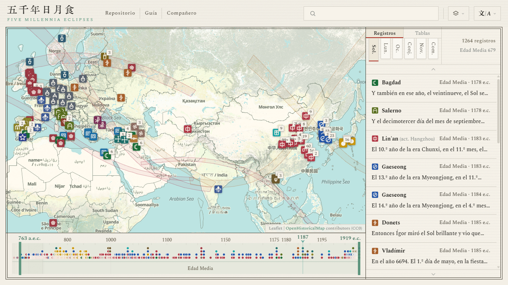

#  Cinco milenios de eclipses

[简体中文](../zh-Hans/README.md) · [繁體中文](../zh-Hant/README.md) · [English](../en/README.md) · [Français](../fr/README.md) · **Español** · [Italiano](../it/README.md) · [日本語](../ja/README.md)

  

**Sitio**: <https://higashimado.github.io/FiveMillenniaEclipses/>

Cinco milenios de eclipses es un atlas histórico de registros astronómicos. Reúne los testimonios escritos en todas las épocas y devuelve cada uno al día y al lugar que ese testimonio nombra. Los eclipses de Sol y de Luna constituyen su núcleo; las ocultaciones, las conjunciones, las estrellas invitadas y los cometas completan seis clases de fenómenos, y el corpus reúne hoy más de doce mil entradas. Todo registro datable queda ligado al suceso real recuperado por el cálculo moderno, y todos se alinean sobre una única línea de tiempo que abarca cinco milenios. Quién vio un fenómeno, dónde se vio, qué calendario lo fechó y con qué nombre se designó se leen de un vistazo, a través de culturas y de siglos.

## Registros

El corpus reúne 12 026 registros de 26 civilizaciones. Cada registro conserva el texto original, sus traducciones y una nota editorial en campos separados. Los archivos fuente están en [data/](../data/):

| Archivo | Contenido |
|---|---|
| [`data/records/schema.json`](../data/records/schema.json) | Definición de campos |
| [`data/records/manifest.json`](../data/records/manifest.json) | Inventario de archivos |
| [`data/records/sources.json`](../data/records/sources.json) | Bibliografía |
| `data/records/<phenomenon>/<civilization>.jsonl` | Los propios registros |

### Asia oriental

Asia oriental aporta 11 804 registros, el 98,2 % del corpus, desde 2137 a. C. hasta 1911 d. C. La rama china se apoya en dieciséis de las Veinticuatro Historias junto con la Historia provisional de los Qing, tomando sus tratados de astronomía, de las cinco fases y del calendario, así como sus anales básicos. Se apoya también en los clásicos (Shangshu, Shijing, [Chunqiu](https://zh.wikisource.org/wiki/春秋經) y [Zuozhuan](https://zh.wikisource.org/wiki/春秋左氏傳)), en las inscripciones oraculares de Yinxu y en varias misceláneas y poemas. La mayoría de los textos sigue las ediciones puntuadas de [Wikisource](https://zh.wikisource.org/).

Veintitrés fuentes principales suman 11 666 registros, el 98,8 % de la rama de Asia oriental, ordenadas aquí por el año más antiguo que cada una recoge:

| Fuente | Periodo | Sol. | Lun. | Oc. | Conj. | Nov. | Com. | Total |
|---|---|---:|---:|---:|---:|---:|---:|---:|
| [Book of Han, Treatise on the Five Phases](https://zh.wikisource.org/wiki/%E6%BC%A2%E6%9B%B8/%E5%8D%B7027) | 205 a. C. – 2 d. C. | 45 |  |  |  |  |  | 45 |
| [Samguk sagi](https://zh.wikisource.org/wiki/%E4%B8%89%E5%9C%8B%E5%8F%B2%E8%A8%98/%E5%8D%B701) | 54 a. C. – 911 d. C. | 44 |  |  |  | 3 | 7 | 54 |
| [Book of Later Han, Treatise on the Five Phases VI](https://zh.wikisource.org/wiki/%E5%BE%8C%E6%BC%A2%E6%9B%B8/%E5%8D%B7108) | 26–219 | 65 |  |  |  |  |  | 65 |
| [Book of Later Han, Treatise on Astronomy](https://zh.wikisource.org/wiki/%E5%BE%8C%E6%BC%A2%E6%9B%B8/%E5%8D%B7102) | 55–213 | 1 |  |  |  | 11 | 17 | 29 |
| [Book of Song, Treatise on the Five Phases](https://zh.wikisource.org/wiki/%E5%AE%8B%E6%9B%B8/%E5%8D%B734) | 221–479 | 73 |  |  |  |  |  | 73 |
| [Book of Jin, Treatise on Astronomy](https://zh.wikisource.org/wiki/%E6%99%89%E6%9B%B8/%E5%8D%B7013) | 222–418 |  | 1 |  |  | 6 | 47 | 54 |
| [Book of Wei, Treatise on Celestial Phenomena](https://zh.wikisource.org/wiki/%E9%AD%8F%E6%9B%B8/%E5%8D%B7105%E4%B9%8B%E4%B8%80) | 400–549 | 32 | 36 |  |  | 3 | 23 | 94 |
| [Book of Sui, Treatise on Astronomy](https://zh.wikisource.org/wiki/%E9%9A%8B%E6%9B%B8/%E5%8D%B721) | 502–617 | 11 | 3 | 175 | 12 | 4 | 14 | 219 |
| [New Book of Tang, Treatise on Astronomy](https://zh.wikisource.org/wiki/%E6%96%B0%E5%94%90%E6%9B%B8/%E5%8D%B7033) | 618–906 | 90 |  | 389 | 1 | 6 | 48 | 534 |
| [Old Book of Tang, Treatise on Astronomy](https://zh.wikisource.org/wiki/%E8%88%8A%E5%94%90%E6%9B%B8/%E5%8D%B736) | 626–839 | 1 | 1 |  |  |  | 18 | 20 |
| [Rikkokushi](https://zh.wikisource.org/wiki/%E6%97%A5%E6%9C%AC%E6%9B%B8%E7%B4%80/%E5%8D%B7%E7%AC%AC%E4%B8%89%E5%8D%81) | 680–887 | 97 | 4 |  |  |  |  | 101 |
| [Fusō ryakki](https://zh.wikisource.org/wiki/%E6%89%B6%E6%A1%91%E7%95%A5%E8%A8%98/%E7%AC%AC023); Hyakurenshō; Azuma kagami | 898–1265 | 20 |  |  |  |  |  | 20 |
| [Old History of the Five Dynasties, Treatise on Astronomy](https://zh.wikisource.org/wiki/%E8%88%8A%E4%BA%94%E4%BB%A3%E5%8F%B2/%E5%8D%B7139) | 911–958 | 9 | 11 |  |  |  | 6 | 26 |
| [History of Song, Treatise on Astronomy](https://zh.wikisource.org/wiki/%E5%AE%8B%E5%8F%B2/%E5%8D%B7053) | 960–1275 | 121 | 149 | 4,819 |  | 17 | 21 | 5,127 |
| [Đại Việt sử ký toàn thư](https://zh.wikisource.org/wiki/%E5%A4%A7%E8%B6%8A%E5%8F%B2%E8%A8%98%E5%85%A8%E6%9B%B8/%E6%9C%AC%E7%B4%80%E5%8D%B7%E4%B9%8B%E4%BA%94) | 993–1774 | 46 | 32 |  |  |  |  | 78 |
| [Goryeosa, Treatise on Astronomy](https://zh.wikisource.org/wiki/%E9%AB%98%E9%BA%97%E5%8F%B2/%E5%8D%B7%E5%9B%9B%E5%8D%81%E5%85%AB) | 1012–1393 | 119 | 97 | 1,911 | 4 | 3 | 15 | 2,149 |
| [History of Jin, Treatise on Astronomy](https://zh.wikisource.org/wiki/%E9%87%91%E5%8F%B2/%E5%8D%B720) | 1120–1232 | 8 | 25 | 209 | 4 | 2 | 5 | 253 |
| [History of Yuan, Treatise on Astronomy](https://zh.wikisource.org/wiki/%E5%85%83%E5%8F%B2/%E5%8D%B7049) | 1264–1367 | 35 |  | 571 | 8 | 1 | 18 | 633 |
| [History of Ming, Treatise on Astronomy](https://zh.wikisource.org/wiki/%E6%98%8E%E5%8F%B2/%E5%8D%B726) | 1368–1642 |  |  | 972 | 45 |  | 38 | 1,055 |
| [History of Ming, Basic Annals](https://zh.wikisource.org/wiki/%E6%98%8E%E5%8F%B2/%E5%8D%B72) | 1371–1643 | 75 |  |  |  |  |  | 75 |
| [Veritable Records of the Joseon Dynasty](https://zh.wikisource.org/wiki/%E6%9C%9D%E9%AE%AE%E7%8E%8B%E6%9C%9D%E5%AF%A6%E9%8C%84/%E5%93%B2%E5%AE%97%E5%AF%A6%E9%8C%84/%E5%8D%81%E4%BA%8C%E5%B9%B4) | 1400–1863 | 84 | 32 |  |  | 84 | 297 | 497 |
| [Draft History of Qing, Treatise on Astronomy](https://zh.wikisource.org/wiki/%E6%B8%85%E5%8F%B2%E7%A8%BF/%E5%8D%B737) | 1618–1796 | 50 |  | 357 |  |  | 25 | 432 |
| [Draft History of Qing, Basic Annals](https://zh.wikisource.org/wiki/%E6%B8%85%E5%8F%B2%E7%A8%BF/%E5%8D%B716) | 1646–1911 | 33 |  |  |  |  |  | 33 |

Las veintisiete fuentes restantes reúnen 138 registros, entre ellos el eclipse de Zhongkang en el [Shangshu, «Yinzheng»](https://zh.wikisource.org/wiki/尚書/胤征), las inscripciones oraculares de Yinxu, el [Shijing, «Xiaoya, Shiyue zhi jiao»](https://zh.wikisource.org/wiki/詩經/十月之交), el [Yueshi shi](https://zh.wikisource.org/wiki/全唐詩/卷388) de Lu Tong y el [Yueshi shi xiao Yuchuanzi zuo](https://zh.wikisource.org/wiki/全唐詩/卷340) de Han Yu, el [Liaoshi](https://zh.wikisource.org/wiki/%E9%81%BC%E5%8F%B2/%E5%8D%B722), el Meigetsuki de Fujiwara no Teika, el [Xixia shushi](https://zh.wikisource.org/wiki/%E8%A5%BF%E5%A4%8F%E6%9B%B8%E4%BA%8B/29), el [Changchun zhenren xiyou ji](https://zh.wikisource.org/wiki/%E9%95%B7%E6%98%A5%E7%9C%9F%E4%BA%BA%E8%A5%BF%E9%81%8A%E8%A8%98/%E5%8D%B7%E4%B8%8A), el [Xu Zizhi Tongjian](https://zh.wikisource.org/wiki/續資治通鑑) y el Rishi de Shu Yuexiang.

### Fuera de Asia oriental

Fuera de Asia oriental hay 222 registros repartidos en 21 civilizaciones. No son obra de un cargo que vigilara el cielo día tras día; son testigos aislados, un suceso cada vez. Antes de la época moderna las fuentes son crónicas, historias, códices y tablillas. Desde el siglo XVII ya no hay libros, sino informes de observatorio, comunicaciones de sociedades científicas y cartas privadas: la tercera columna reúne por eso obras y observadores.

| Civilización | Periodo | Obras e informes | Sol. | Lun. | Total |
|---|---|---|---:|---:|---:|
| Árabe | 829–1226 | [Ḥabash al-Ḥāsib](https://gallica.bnf.fr/ark:/12148/bpt6k5626201z), [al-Māhānī](https://gallica.bnf.fr/ark:/12148/bpt6k5626201z), al-Battānī, [Ibn Amājūr](https://gallica.bnf.fr/ark:/12148/bpt6k5626201z), [Ibn Yūnus](https://gallica.bnf.fr/ark:/12148/bpt6k5626201z), [al-Bīrūnī](https://archive.org/details/chronologyofanci00biru), [Ibn al-Athīr, *al-Kamil fi al-Ta'rikh*](https://archive.org/details/kamil-Tornberg), [Ibn ʿIdhārī](https://archive.org/details/bub_gb_MiyHAAAAMAAJ) | 19 | 27 | 46 |
| Bretaña | 664–1919 | [Bede, *Historia Ecclesiastica*](https://www.gutenberg.org/cache/epub/38326/pg38326-images.html), [*Anglo-Saxon Chronicle*](https://en.wikisource.org/wiki/Anglo-Saxon_Chronicle), [John of Worcester, *Chronicon ex chronicis*](https://archive.org/details/florentiiwigorn00florgoog), [William of Malmesbury, *Historia Novella*](https://archive.org/details/stubdegestisregumanglorum1), [Henry of Huntingdon, *Historia Anglorum*](https://archive.org/details/henriciarchidia00unkngoog), [Gervase of Canterbury, *Chronica*](https://archive.org/details/thehistoricalworksofgerva1), [Matthew Paris, *Chronica Majora*](https://archive.org/details/matthiparisiensi03pari), [Thomas Walsingham, *Historia Anglicana*](https://archive.org/details/thomaewalsingham01wals), [Walter Bower, *Scotichronicon*](https://archive.org/details/scotichronicon-v-1-bks-1-2), John Lamont, John Nicoll, [Alice Thornton](https://archive.org/details/autobiographyofm00thor), [John Evelyn](https://archive.org/details/in.ernet.dli.2015.272771), [Halley](https://archive.org/details/bim_eighteenth-century_a-description-of-the-pas_halley-edmund_1715_0), [Baily](https://archive.org/details/paper-doi-10_1093_mnras_4_2_15), [De la Rue](https://archive.org/details/ontotalsolarecli00dela), [Lockyer](https://archive.org/details/contributionsto00lockgoog), Copeland, [Dyson](https://archive.org/details/philtrans06337895), Eddington | 31 | 8 | 39 |
| Sacro Imperio | 806–1852 | [*Annales regni Francorum*](https://thelatinlibrary.com/annalesregnifrancorum.html), [*Annales Bertiniani*](https://archive.org/stream/annalesbertinian00wait/annalesbertinian00wait_djvu.txt), [*Annales Hildesheimenses*](https://www.dmgh.de/mgh_ss_3/index.htm), [*Annales Marbacenses*](https://www.dmgh.de/mgh_ss_rer_germ_9/index.htm), [Annalista Saxo](https://www.dmgh.de/mgh_ss_6/index.htm), [Regino of Prüm, *Chronicon*](https://www.dmgh.de/mgh_ss_rer_germ_50/), [Sigebert of Gembloux, *Chronicon*](https://www.dmgh.de/mgh_ss_6/index.htm), [Peter of Zittau, *Zbraslav Chronicle*](https://archive.org/details/fontesrerumbohem04emle), [Vavřinec of Březová, *Historia Hussitica*](https://archive.org/details/fontesrerumbohe00goog), [Gemma Frisius](https://archive.org/details/gemmaefrisiimedi00gemm), David Fabricius, [Kepler, *Ad Vitellionem Paralipomena*](https://archive.org/details/advitellionempar00kepl), [*De Stella Nova*](https://archive.org/details/10873675bsb), Heinsius, Rümker, Busch, Galle, d'Arrest, Wolf, Klinkerfues | 12 | 16 | 28 |
| América | 1806–1918 | [Ferrer](https://archive.org/details/jstor-1004811), Maria Mitchell, Harkness, Gilman, Rogers, Young, Lockett, Willson, Seagrave, [Campbell](https://archive.org/details/jstor-984400), Hammond, Adams, [Stebbins](https://archive.org/details/jstor-984404), Morehouse, Pettit | 19 | 0 | 19 |
| Babilonia | 1223–183 a. C. | [*Babylonian Astronomical Diaries*](http://oracc.museum.upenn.edu/adsd/), [Ptolemy, *Almagest*](https://archive.org/details/bub_gb_a9nvvbG-OOIC), [tablet BM 33066](https://cdli.earth/search?q=BM+33066), [Ugaritic tablet KTU 1.78](https://cdli.earth/search?q=RS+12.061) | 1 | 11 | 12 |
| Italia | 1178–1852 | [Romuald II Guarna, *Chronicon*](https://www.dmgh.de/mgh_ss_19/), [Ristoro d'Arezzo, *La composizione del mondo*](https://archive.org/details/lacomposizionedelmondo), [Salimbene de Adam, *Cronica*](https://www.dmgh.de/mgh_ss_32/index.htm), [*Annales Placentini Gibellini*](https://www.dmgh.de/mgh_ss_18/), [*Chronicon Foroliviense*](https://archive.org/details/rerumitalicarums271mura), [Nicolò Barbaro, *Giornale dell'assedio di Costantinopoli*](https://vec.wikisource.org/wiki/Giornale_dell%27assedio_di_Costantinopoli_1453), [Gervase of Canterbury, *Chronica*](https://archive.org/details/thehistoricalworksofgerva1), [Clavius](https://archive.org/details/christophoriclau00clav_1), [Kepler, *De Stella Nova*](https://archive.org/details/10873675bsb), Secchi | 8 | 4 | 12 |
| Siríaco | 512–1191 | [Michael the Syrian, *Chronicle*](https://archive.org/details/chroniquedemiche01mich) | 9 | 2 | 11 |
| Francia | 1033–1905 | [Rodulfus Glaber, *Historiarum libri quinque*](https://archive.org/details/rodulfiglabrihis0000glab), [Robert of Torigny, *Chronica*](https://www.dmgh.de/mgh_ss_6/index.htm), [*Le Petit Thalamus de Montpellier*](https://archive.org/details/thalamusparvusmontpellierma), [Michel Pintoin, *Chronicorum Karoli Sexti*](https://gallica.bnf.fr/ark:/12148/bpt6k6224315z), Maraldi, Cassini, Janssen, Lescarbault, Štefánik | 8 | 2 | 10 |
| Iberia | 939–1560 | [*Annales Castellani Antiquiores*](https://archive.org/details/espanasagradathe23flor), [*Anales Toledanos Primeros*](https://archive.org/details/espanasagradathe23flor), [*Crónica de Cerrato*](https://archive.org/details/espanasagradathe23flor), [*Chronicon Conimbricense*](https://archive.org/details/portugaliaemonumentahistoricascrv1), [Andrés Bernáldez, *Historia de los Reyes Católicos*](https://archive.org/details/historiadelosrey00bern), Ferdinand Columbus, *Historie*, [Clavius](https://archive.org/details/christophoriclau00clav_1) | 7 | 1 | 8 |
| Armenia | 1099–1736 | [Matthew of Edessa](https://archive.org/details/bub_gb_YlkuAAAAQAAJ), [Gregory the Priest](https://archive.org/details/bub_gb_YlkuAAAAQAAJ), [Samuel of Ani, *Tables chronologiques*](https://archive.org/details/collectiondhist00arhagoog), [Arakel of Tabriz](https://archive.org/details/collectiondhist00arhagoog), [Abraham of Crete](https://archive.org/details/collectiondhist00arhagoog) | 4 | 3 | 7 |
| Griego | 648 a. C. – 71 d. C. | [Archilochus, fr. 122 West](https://www.perseus.tufts.edu/hopper/text?doc=Perseus:text:1999.01.0060:bekker+page=1418b), [Herodotus, *Historiae*](https://www.perseus.tufts.edu/hopper/text?doc=Perseus:text:1999.01.0126:book=1:chapter=74), [Thucydides, *History of the Peloponnesian War*](https://en.wikisource.org/wiki/History_of_the_Peloponnesian_War/Book_7), [Diodorus Siculus, *Bibliotheca Historica*](https://penelope.uchicago.edu/Thayer/E/Roman/Texts/Diodorus_Siculus/20A*.html), [Pappus of Alexandria, *Commentary on the Almagest*](https://archive.nyu.edu/bitstream/2451/61288/56/11.%20Carman.pdf), [Plutarch, *De facie in orbe lunae*](https://penelope.uchicago.edu/Thayer/E/Roman/Texts/Plutarch/Moralia/The_Face_in_the_Moon*/home.html) | 6 | 1 | 7 |
| Nórdico | 1030–1581 | [Snorri Sturluson, *Heimskringla*](https://www.gutenberg.org/files/598/598-h/598-h.htm), [Sturla Þórðarson, *Saga of Haakon Haakonsson*](https://archive.org/details/icelandicsagasot02stur), [Tycho Brahe, *Astronomiae Instauratae Progymnasmata*](https://archive.org/details/bub_gb_CVOItHLenPEC), [Gassendi](https://archive.org/details/den-kbd-pil-130018157889-001) | 3 | 2 | 5 |
| Eslavo | 1185–1406 | [*Hypatian Chronicle*](https://archive.org/details/Complete_Collection_of_Russian_Chronicles_1923_Vol_2_Hypatian_Chronicle), [*Laurentian Chronicle*](https://archive.org/details/Complete_Collection_of_Russian_Chronicles_1926_Vol_1_Laurentian_Chronicle), [*Novgorod First Chronicle*](https://archive.org/details/chronicleofnovgo00michrich), [*Chronicle of Janko z Czarnkowa*](https://archive.org/details/monumentapoloni00bielgoog) | 4 | 0 | 4 |
| Bizancio | 968–1453 | [Leo the Deacon, *Historia*](https://archive.org/details/corpusscriptoru12unkngoog), [Anna Komnene](https://en.wikisource.org/wiki/The_Alexiad), Pseudo-Sphrantzes, *Chronicon Maius* | 2 | 1 | 3 |
| Rusia | 1748–1791 | Braun, Popov, Rumovsky, Inochodzov | 3 | 0 | 3 |
| Roma | 190–168 a. C. | [Livy, *Ab Urbe Condita*](https://www.thelatinlibrary.com/livy/liv.37.shtml), [Plutarch, *Aemilius Paullus*](https://penelope.uchicago.edu/Thayer/E/Roman/Texts/Plutarch/Lives/Aemilius*.html) | 1 | 1 | 2 |
| Maya | 755, 859 | [*Dresden Codex*](https://www.famsi.org/mayawriting/codices/dresden.html) | 2 | 0 | 2 |
| Hitita | 1312 a. C. | *Annals of Mursili II* | 1 | 0 | 1 |
| Asiria | 763 a. C. | [*Limmu list*](https://oracc.museum.upenn.edu/saao/saas2/) | 1 | 0 | 1 |
| Azteca | 1496 | *Codex Telleriano-Remensis* | 1 | 0 | 1 |
| América Latina | 1923 | Joaquín Gallo | 1 | 0 | 1 |

## Tablas

Las tablas de eclipses comparten su motor de cálculo con [Substellar Atlas](https://github.com/Higashimado/SubstellarAtlas), mientras que los elementos proceden en su mayor parte de los cánones quinquemilenarios de NASA/Espenak ([5MCSE / 5MCLE](https://eclipse.gsfc.nasa.gov/)): 9 506 eclipses de Sol y 9 650 de Luna. El canon comienza en el año astronómico −1999, es decir 2000 a. C.; para el tramo anterior no existe canon, de modo que los elementos besselianos se calculan a partir de la efeméride [JPL DE441](https://ssd.jpl.nasa.gov/planets/eph_export.html), lo que añade 2 365 eclipses de Sol y 2 381 de Luna, cada uno con un error típico en longitud de entre 4,48° y 7,30°.

**Estructura**

| Archivo | Contenido | Tamaño |
|---|---|---|
| [`data/eclipses/solar.json`](../data/eclipses/solar.json) | Índice solar | 11,871 entradas · 9.1 MB |
| [`data/eclipses/lunar.json`](../data/eclipses/lunar.json) | Índice lunar | 12,031 entradas · 9.3 MB |
| [`data/eclipses/events/`](../data/eclipses/events/) `<date>.json` | Curvas de contacto y polinomios besselianos | 11,871 archivos · 219 MB |
| [`data/eclipses/bessel-5mcse.json`](../data/eclipses/bessel-5mcse.json) | Elementos NASA 5MCSE | 9,506 entradas |

## Concordancias

Seis tablas de concordancia indexan los lugares, las fechas y los objetos nombrados en los registros; son ellas las que atan un registro a su suceso.

**Estructura**

| Archivo | Contenido | Entradas |
|---|---|---:|
| [`data/duizhao/xingguan.json`](../data/duizhao/xingguan.json) | Objetos celestes | 391 |
| [`data/duizhao/nianhao.json`](../data/duizhao/nianhao.json) | Eras chinas (140 BCE – 1911) | 330 |
| [`data/duizhao/nengo.json`](../data/duizhao/nengo.json) | Eras japonesas (645 – act.) | 241 |
| [`data/duizhao/diming.json`](../data/duizhao/diming.json) | Lugares de observación | 164 |
| [`data/duizhao/wenming.json`](../data/duizhao/wenming.json) | Identidades de civilizaciones | 28 |
| [`data/duizhao/quyu.json`](../data/duizhao/quyu.json) | Regiones geográficas | 124 |

## Créditos y licencia

El código propio del proyecto se publica bajo [**GNU General Public License v3.0**](../LICENSE); [`data/records/`](../data/records/README.md) y [`data/duizhao/`](../data/duizhao/README.md) se publican bajo [**CC-BY-SA 4.0**](https://creativecommons.org/licenses/by-sa/4.0/). El código, los datos y las tipografías de terceros conservan sus respectivas licencias.

| Uso | Componente (versión) | Autor / Fuente | Licencia |
|---|---|---|---|
| Geometría de sombra | AstroMeteoMap | Higashimado | GPL-3.0 |
| Motor cartográfico | [Leaflet](https://leafletjs.com/) 1.9.4 | Volodymyr Agafonkin | BSD-2-Clause |
| Renderizado vectorial | [MapLibre GL JS](https://maplibre.org/) 5.24.0 | MapLibre | BSD-3-Clause |
| Puente de capas | [maplibre-gl-leaflet](https://github.com/maplibre/maplibre-gl-leaflet) 0.1.3 | MapLibre | ISC |
| Filtrado temporal | [maplibre-gl-dates](https://github.com/OpenHistoricalMap/maplibre-gl-dates) 1.3.0 | OpenHistoricalMap | ISC |
| Astronomía | [Astronomy Engine](https://github.com/cosinekitty/astronomy) 2.1.19 | Don Cross | MIT |
| Canon de eclipses | [5MCSE / 5MCLE](https://eclipse.gsfc.nasa.gov/) | Fred Espenak (NASA GSFC) | Dominio público + atribución |
| Efemérides antiguas | [JPL DE441](https://ssd.jpl.nasa.gov/planets/eph_export.html) | JPL | Dominio público |
| Rotación terrestre | [Stephenson, Morrison & Hohenkerk 2016](https://doi.org/10.1098/rspa.2016.0404) | Royal Society | CC BY-SA 4.0 |
| Mapa base histórico | [OpenHistoricalMap](https://www.openhistoricalmap.org/) | Comunidad OHM | Datos CC0 |
| Mapa base moderno | [CARTO](https://carto.com/) Positron · Voyager | CARTO | © CARTO |
| Mapa base moderno | [OpenStreetMap](https://www.openstreetmap.org/) capa estándar | Colaboradores de OSM | ODbL |
| Mapa base de relieve | [Esri World Shaded Relief](https://www.esri.com/) | Esri / USGS | © Esri |
| Datos de mapa base | [OpenStreetMap](https://www.openstreetmap.org/copyright) | Colaboradores de OSM | ODbL |
| Textos dinásticos | [Wikisource](https://zh.wikisource.org/) | Colaboradores de Wikisource | CC-BY-SA 4.0 |
| Fuentes CJK | [Source Han Serif](https://github.com/adobe-fonts/source-han-serif) | Adobe | OFL |
| Fuentes latinas | [Spectral](https://fonts.google.com/specimen/Spectral) | Production Type | OFL |
| Serif multiescritura | [Noto Serif](https://fonts.google.com/noto) · Naskh Arabic · Serif Armenian · Serif Hebrew | Google | OFL |
| Fuente de titulares | [KingHwaOldSong](https://fonts.zeoseven.com/) | ZeoSeven Fonts | véase [licenses](../licenses/) |

Cinco milenios forman un campo amplio, y las omisiones y los errores son inevitables. Nuevas fuentes, correcciones y argumentos sobre datación o identificación son bienvenidos: por favor abra una [issue](https://github.com/Higashimado/FiveMillenniaEclipses/issues).
