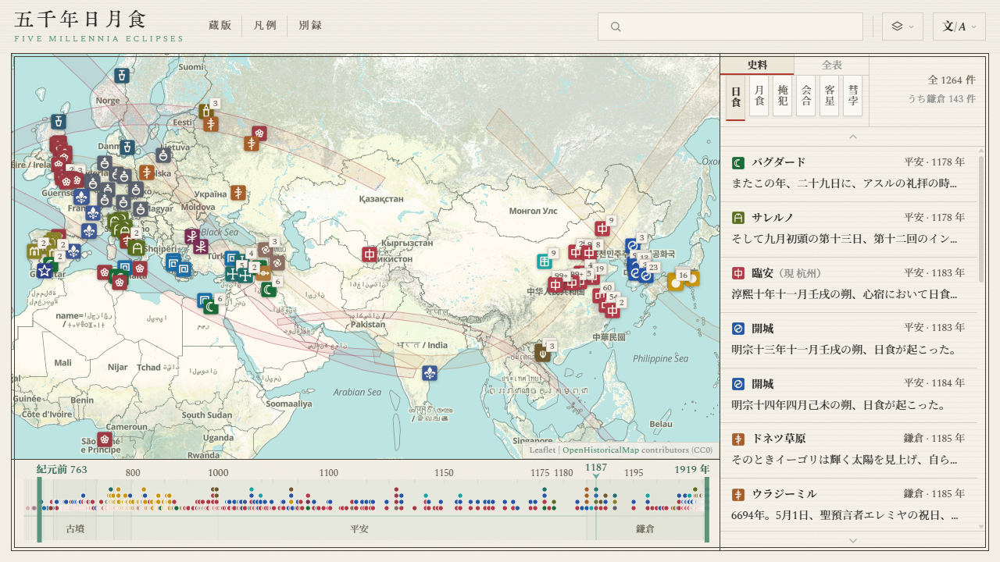

#  五千年日月食

[简体中文](../zh-Hans/README.md) · [繁體中文](../zh-Hant/README.md) · [English](../en/README.md) · [Français](../fr/README.md) · [Español](../es/README.md) · [Italiano](../it/README.md) · **日本語**

  

**サイト**: <https://higashimado.github.io/FiveMillenniaEclipses/>

五千年日月食は、天象の記録を集めた歴史天文図志です。歴代に書き留められた記録を集め、その記録が指す日と土地へそれぞれ戻します。日食・月食を中核とし、掩犯・会合・客星・彗孛を併せて六種の現象を収め、現在は一万二千余条を数えます。年代の定まる記録はいずれも現代の計算で復元した実際の事象に結び付けられ、五千年にわたる一本の年表の上に並びます。誰が見たか、どこで見たか、どの暦で日付を記したか、どの名で呼んだかが、文化と世紀を越えて一目で読み取れます。

## 史料

本コーパスは 26 文明・12 026 条を収めます。各条は原文・訳文・編者注をそれぞれ別のフィールドに保存します。原ファイルは [data/](../data/) 以下にあります。

| ファイル | 内容 |
|---|---|
| [`data/records/schema.json`](../data/records/schema.json) | フィールド定義 |
| [`data/records/manifest.json`](../data/records/manifest.json) | ファイル一覧 |
| [`data/records/sources.json`](../data/records/sources.json) | 書目 |
| `data/records/<phenomenon>/<civilization>.jsonl` | 記録本体 |

### 東アジア

東アジアは 11 804 条、全体の 98.2 % を占め、年代は前 2137 年から 1911 年に及びます。中国の一支は二十四史のうち十六部と『清史稿』に拠り、その天文志・五行志・律暦志と本紀を採ります。ほかに経部の『尚書』『詩経』『[春秋](https://zh.wikisource.org/wiki/春秋經)』『[左伝](https://zh.wikisource.org/wiki/春秋左氏傳)』、殷墟甲骨、および若干の筆記・詩文にも拠ります。テキストの多くは [Wikisource](https://zh.wikisource.org/) の校点本に従います。

主要な出典二十三種で 11 666 条、東アジアの一支の 98.8 % を占めます。各出典が記す最も古い年の順に並べます。

| 出典 | 年代 | 日 | 月 | 掩 | 会 | 客 | 彗 | 条数 |
|---|---|---:|---:|---:|---:|---:|---:|---:|
| [Book of Han, Treatise on the Five Phases](https://zh.wikisource.org/wiki/%E6%BC%A2%E6%9B%B8/%E5%8D%B7027) | 前205–2 | 45 |  |  |  |  |  | 45 |
| [Samguk sagi](https://zh.wikisource.org/wiki/%E4%B8%89%E5%9C%8B%E5%8F%B2%E8%A8%98/%E5%8D%B701) | 前54–911 | 44 |  |  |  | 3 | 7 | 54 |
| [Book of Later Han, Treatise on the Five Phases VI](https://zh.wikisource.org/wiki/%E5%BE%8C%E6%BC%A2%E6%9B%B8/%E5%8D%B7108) | 26–219 | 65 |  |  |  |  |  | 65 |
| [Book of Later Han, Treatise on Astronomy](https://zh.wikisource.org/wiki/%E5%BE%8C%E6%BC%A2%E6%9B%B8/%E5%8D%B7102) | 55–213 | 1 |  |  |  | 11 | 17 | 29 |
| [Book of Song, Treatise on the Five Phases](https://zh.wikisource.org/wiki/%E5%AE%8B%E6%9B%B8/%E5%8D%B734) | 221–479 | 73 |  |  |  |  |  | 73 |
| [Book of Jin, Treatise on Astronomy](https://zh.wikisource.org/wiki/%E6%99%89%E6%9B%B8/%E5%8D%B7013) | 222–418 |  | 1 |  |  | 6 | 47 | 54 |
| [Book of Wei, Treatise on Celestial Phenomena](https://zh.wikisource.org/wiki/%E9%AD%8F%E6%9B%B8/%E5%8D%B7105%E4%B9%8B%E4%B8%80) | 400–549 | 32 | 36 |  |  | 3 | 23 | 94 |
| [Book of Sui, Treatise on Astronomy](https://zh.wikisource.org/wiki/%E9%9A%8B%E6%9B%B8/%E5%8D%B721) | 502–617 | 11 | 3 | 175 | 12 | 4 | 14 | 219 |
| [New Book of Tang, Treatise on Astronomy](https://zh.wikisource.org/wiki/%E6%96%B0%E5%94%90%E6%9B%B8/%E5%8D%B7033) | 618–906 | 90 |  | 389 | 1 | 6 | 48 | 534 |
| [Old Book of Tang, Treatise on Astronomy](https://zh.wikisource.org/wiki/%E8%88%8A%E5%94%90%E6%9B%B8/%E5%8D%B736) | 626–839 | 1 | 1 |  |  |  | 18 | 20 |
| [Rikkokushi](https://zh.wikisource.org/wiki/%E6%97%A5%E6%9C%AC%E6%9B%B8%E7%B4%80/%E5%8D%B7%E7%AC%AC%E4%B8%89%E5%8D%81) | 680–887 | 97 | 4 |  |  |  |  | 101 |
| [Fusō ryakki](https://zh.wikisource.org/wiki/%E6%89%B6%E6%A1%91%E7%95%A5%E8%A8%98/%E7%AC%AC023); Hyakurenshō; Azuma kagami | 898–1265 | 20 |  |  |  |  |  | 20 |
| [Old History of the Five Dynasties, Treatise on Astronomy](https://zh.wikisource.org/wiki/%E8%88%8A%E4%BA%94%E4%BB%A3%E5%8F%B2/%E5%8D%B7139) | 911–958 | 9 | 11 |  |  |  | 6 | 26 |
| [History of Song, Treatise on Astronomy](https://zh.wikisource.org/wiki/%E5%AE%8B%E5%8F%B2/%E5%8D%B7053) | 960–1275 | 121 | 149 | 4,819 |  | 17 | 21 | 5,127 |
| [Đại Việt sử ký toàn thư](https://zh.wikisource.org/wiki/%E5%A4%A7%E8%B6%8A%E5%8F%B2%E8%A8%98%E5%85%A8%E6%9B%B8/%E6%9C%AC%E7%B4%80%E5%8D%B7%E4%B9%8B%E4%BA%94) | 993–1774 | 46 | 32 |  |  |  |  | 78 |
| [Goryeosa, Treatise on Astronomy](https://zh.wikisource.org/wiki/%E9%AB%98%E9%BA%97%E5%8F%B2/%E5%8D%B7%E5%9B%9B%E5%8D%81%E5%85%AB) | 1012–1393 | 119 | 97 | 1,911 | 4 | 3 | 15 | 2,149 |
| [History of Jin, Treatise on Astronomy](https://zh.wikisource.org/wiki/%E9%87%91%E5%8F%B2/%E5%8D%B720) | 1120–1232 | 8 | 25 | 209 | 4 | 2 | 5 | 253 |
| [History of Yuan, Treatise on Astronomy](https://zh.wikisource.org/wiki/%E5%85%83%E5%8F%B2/%E5%8D%B7049) | 1264–1367 | 35 |  | 571 | 8 | 1 | 18 | 633 |
| [History of Ming, Treatise on Astronomy](https://zh.wikisource.org/wiki/%E6%98%8E%E5%8F%B2/%E5%8D%B726) | 1368–1642 |  |  | 972 | 45 |  | 38 | 1,055 |
| [History of Ming, Basic Annals](https://zh.wikisource.org/wiki/%E6%98%8E%E5%8F%B2/%E5%8D%B72) | 1371–1643 | 75 |  |  |  |  |  | 75 |
| [Veritable Records of the Joseon Dynasty](https://zh.wikisource.org/wiki/%E6%9C%9D%E9%AE%AE%E7%8E%8B%E6%9C%9D%E5%AF%A6%E9%8C%84/%E5%93%B2%E5%AE%97%E5%AF%A6%E9%8C%84/%E5%8D%81%E4%BA%8C%E5%B9%B4) | 1400–1863 | 84 | 32 |  |  | 84 | 297 | 497 |
| [Draft History of Qing, Treatise on Astronomy](https://zh.wikisource.org/wiki/%E6%B8%85%E5%8F%B2%E7%A8%BF/%E5%8D%B737) | 1618–1796 | 50 |  | 357 |  |  | 25 | 432 |
| [Draft History of Qing, Basic Annals](https://zh.wikisource.org/wiki/%E6%B8%85%E5%8F%B2%E7%A8%BF/%E5%8D%B716) | 1646–1911 | 33 |  |  |  |  |  | 33 |

残る二十七種は 138 条で、『[尚書](https://zh.wikisource.org/wiki/尚書/胤征)』胤征の仲康日食、殷墟甲骨、『[詩経](https://zh.wikisource.org/wiki/詩經/十月之交)』小雅・十月之交、盧仝『[月蝕詩](https://zh.wikisource.org/wiki/全唐詩/卷388)』と韓愈『[月蝕詩效玉川子作](https://zh.wikisource.org/wiki/全唐詩/卷340)』、『[遼史](https://zh.wikisource.org/wiki/%E9%81%BC%E5%8F%B2/%E5%8D%B722)』、藤原定家『明月記』、『[西夏書事](https://zh.wikisource.org/wiki/%E8%A5%BF%E5%A4%8F%E6%9B%B8%E4%BA%8B/29)』、『[長春真人西遊記](https://zh.wikisource.org/wiki/%E9%95%B7%E6%98%A5%E7%9C%9F%E4%BA%BA%E8%A5%BF%E9%81%8A%E8%A8%98/%E5%8D%B7%E4%B8%8A)』、『[續資治通鑑](https://zh.wikisource.org/wiki/續資治通鑑)』、舒岳祥『日食』詩などを含みます。

### その他

東アジア以外は 21 文明・222 条です。官を置いて日々書き継いだものではなく、一事ごとの単発の証言です。近世以前の典拠は編年史・史書・写本・粘土板であり、十七世紀以降は「書」ではなく天文台報告・学会通信・私信に替わります。そのため下表の第三列は典籍と観測者を併せて挙げます。

| 文明 | 年代 | 典籍・報告 | 日 | 月 | 条数 |
|---|---|---|---:|---:|---:|
| アラビア | 829–1226 | [Ḥabash al-Ḥāsib](https://gallica.bnf.fr/ark:/12148/bpt6k5626201z), [al-Māhānī](https://gallica.bnf.fr/ark:/12148/bpt6k5626201z), al-Battānī, [Ibn Amājūr](https://gallica.bnf.fr/ark:/12148/bpt6k5626201z), [Ibn Yūnus](https://gallica.bnf.fr/ark:/12148/bpt6k5626201z), [al-Bīrūnī](https://archive.org/details/chronologyofanci00biru), [Ibn al-Athīr, *al-Kamil fi al-Ta'rikh*](https://archive.org/details/kamil-Tornberg), [Ibn ʿIdhārī](https://archive.org/details/bub_gb_MiyHAAAAMAAJ) | 19 | 27 | 46 |
| ブリテン | 664–1919 | [Bede, *Historia Ecclesiastica*](https://www.gutenberg.org/cache/epub/38326/pg38326-images.html), [*Anglo-Saxon Chronicle*](https://en.wikisource.org/wiki/Anglo-Saxon_Chronicle), [John of Worcester, *Chronicon ex chronicis*](https://archive.org/details/florentiiwigorn00florgoog), [William of Malmesbury, *Historia Novella*](https://archive.org/details/stubdegestisregumanglorum1), [Henry of Huntingdon, *Historia Anglorum*](https://archive.org/details/henriciarchidia00unkngoog), [Gervase of Canterbury, *Chronica*](https://archive.org/details/thehistoricalworksofgerva1), [Matthew Paris, *Chronica Majora*](https://archive.org/details/matthiparisiensi03pari), [Thomas Walsingham, *Historia Anglicana*](https://archive.org/details/thomaewalsingham01wals), [Walter Bower, *Scotichronicon*](https://archive.org/details/scotichronicon-v-1-bks-1-2), John Lamont, John Nicoll, [Alice Thornton](https://archive.org/details/autobiographyofm00thor), [John Evelyn](https://archive.org/details/in.ernet.dli.2015.272771), [Halley](https://archive.org/details/bim_eighteenth-century_a-description-of-the-pas_halley-edmund_1715_0), [Baily](https://archive.org/details/paper-doi-10_1093_mnras_4_2_15), [De la Rue](https://archive.org/details/ontotalsolarecli00dela), [Lockyer](https://archive.org/details/contributionsto00lockgoog), Copeland, [Dyson](https://archive.org/details/philtrans06337895), Eddington | 31 | 8 | 39 |
| 神聖ローマ | 806–1852 | [*Annales regni Francorum*](https://thelatinlibrary.com/annalesregnifrancorum.html), [*Annales Bertiniani*](https://archive.org/stream/annalesbertinian00wait/annalesbertinian00wait_djvu.txt), [*Annales Hildesheimenses*](https://www.dmgh.de/mgh_ss_3/index.htm), [*Annales Marbacenses*](https://www.dmgh.de/mgh_ss_rer_germ_9/index.htm), [Annalista Saxo](https://www.dmgh.de/mgh_ss_6/index.htm), [Regino of Prüm, *Chronicon*](https://www.dmgh.de/mgh_ss_rer_germ_50/), [Sigebert of Gembloux, *Chronicon*](https://www.dmgh.de/mgh_ss_6/index.htm), [Peter of Zittau, *Zbraslav Chronicle*](https://archive.org/details/fontesrerumbohem04emle), [Vavřinec of Březová, *Historia Hussitica*](https://archive.org/details/fontesrerumbohe00goog), [Gemma Frisius](https://archive.org/details/gemmaefrisiimedi00gemm), David Fabricius, [Kepler, *Ad Vitellionem Paralipomena*](https://archive.org/details/advitellionempar00kepl), [*De Stella Nova*](https://archive.org/details/10873675bsb), Heinsius, Rümker, Busch, Galle, d'Arrest, Wolf, Klinkerfues | 12 | 16 | 28 |
| アメリカ | 1806–1918 | [Ferrer](https://archive.org/details/jstor-1004811), Maria Mitchell, Harkness, Gilman, Rogers, Young, Lockett, Willson, Seagrave, [Campbell](https://archive.org/details/jstor-984400), Hammond, Adams, [Stebbins](https://archive.org/details/jstor-984404), Morehouse, Pettit | 19 | 0 | 19 |
| バビロニア | 前1223–前183 | [*Babylonian Astronomical Diaries*](http://oracc.museum.upenn.edu/adsd/), [Ptolemy, *Almagest*](https://archive.org/details/bub_gb_a9nvvbG-OOIC), [tablet BM 33066](https://cdli.earth/search?q=BM+33066), [Ugaritic tablet KTU 1.78](https://cdli.earth/search?q=RS+12.061) | 1 | 11 | 12 |
| イタリア | 1178–1852 | [Romuald II Guarna, *Chronicon*](https://www.dmgh.de/mgh_ss_19/), [Ristoro d'Arezzo, *La composizione del mondo*](https://archive.org/details/lacomposizionedelmondo), [Salimbene de Adam, *Cronica*](https://www.dmgh.de/mgh_ss_32/index.htm), [*Annales Placentini Gibellini*](https://www.dmgh.de/mgh_ss_18/), [*Chronicon Foroliviense*](https://archive.org/details/rerumitalicarums271mura), [Nicolò Barbaro, *Giornale dell'assedio di Costantinopoli*](https://vec.wikisource.org/wiki/Giornale_dell%27assedio_di_Costantinopoli_1453), [Gervase of Canterbury, *Chronica*](https://archive.org/details/thehistoricalworksofgerva1), [Clavius](https://archive.org/details/christophoriclau00clav_1), [Kepler, *De Stella Nova*](https://archive.org/details/10873675bsb), Secchi | 8 | 4 | 12 |
| シリア | 512–1191 | [Michael the Syrian, *Chronicle*](https://archive.org/details/chroniquedemiche01mich) | 9 | 2 | 11 |
| フランス | 1033–1905 | [Rodulfus Glaber, *Historiarum libri quinque*](https://archive.org/details/rodulfiglabrihis0000glab), [Robert of Torigny, *Chronica*](https://www.dmgh.de/mgh_ss_6/index.htm), [*Le Petit Thalamus de Montpellier*](https://archive.org/details/thalamusparvusmontpellierma), [Michel Pintoin, *Chronicorum Karoli Sexti*](https://gallica.bnf.fr/ark:/12148/bpt6k6224315z), Maraldi, Cassini, Janssen, Lescarbault, Štefánik | 8 | 2 | 10 |
| イベリア | 939–1560 | [*Annales Castellani Antiquiores*](https://archive.org/details/espanasagradathe23flor), [*Anales Toledanos Primeros*](https://archive.org/details/espanasagradathe23flor), [*Crónica de Cerrato*](https://archive.org/details/espanasagradathe23flor), [*Chronicon Conimbricense*](https://archive.org/details/portugaliaemonumentahistoricascrv1), [Andrés Bernáldez, *Historia de los Reyes Católicos*](https://archive.org/details/historiadelosrey00bern), Ferdinand Columbus, *Historie*, [Clavius](https://archive.org/details/christophoriclau00clav_1) | 7 | 1 | 8 |
| アルメニア | 1099–1736 | [Matthew of Edessa](https://archive.org/details/bub_gb_YlkuAAAAQAAJ), [Gregory the Priest](https://archive.org/details/bub_gb_YlkuAAAAQAAJ), [Samuel of Ani, *Tables chronologiques*](https://archive.org/details/collectiondhist00arhagoog), [Arakel of Tabriz](https://archive.org/details/collectiondhist00arhagoog), [Abraham of Crete](https://archive.org/details/collectiondhist00arhagoog) | 4 | 3 | 7 |
| ギリシャ | 前648–71 | [Archilochus, fr. 122 West](https://www.perseus.tufts.edu/hopper/text?doc=Perseus:text:1999.01.0060:bekker+page=1418b), [Herodotus, *Historiae*](https://www.perseus.tufts.edu/hopper/text?doc=Perseus:text:1999.01.0126:book=1:chapter=74), [Thucydides, *History of the Peloponnesian War*](https://en.wikisource.org/wiki/History_of_the_Peloponnesian_War/Book_7), [Diodorus Siculus, *Bibliotheca Historica*](https://penelope.uchicago.edu/Thayer/E/Roman/Texts/Diodorus_Siculus/20A*.html), [Pappus of Alexandria, *Commentary on the Almagest*](https://archive.nyu.edu/bitstream/2451/61288/56/11.%20Carman.pdf), [Plutarch, *De facie in orbe lunae*](https://penelope.uchicago.edu/Thayer/E/Roman/Texts/Plutarch/Moralia/The_Face_in_the_Moon*/home.html) | 6 | 1 | 7 |
| 北欧 | 1030–1581 | [Snorri Sturluson, *Heimskringla*](https://www.gutenberg.org/files/598/598-h/598-h.htm), [Sturla Þórðarson, *Saga of Haakon Haakonsson*](https://archive.org/details/icelandicsagasot02stur), [Tycho Brahe, *Astronomiae Instauratae Progymnasmata*](https://archive.org/details/bub_gb_CVOItHLenPEC), [Gassendi](https://archive.org/details/den-kbd-pil-130018157889-001) | 3 | 2 | 5 |
| スラブ | 1185–1406 | [*Hypatian Chronicle*](https://archive.org/details/Complete_Collection_of_Russian_Chronicles_1923_Vol_2_Hypatian_Chronicle), [*Laurentian Chronicle*](https://archive.org/details/Complete_Collection_of_Russian_Chronicles_1926_Vol_1_Laurentian_Chronicle), [*Novgorod First Chronicle*](https://archive.org/details/chronicleofnovgo00michrich), [*Chronicle of Janko z Czarnkowa*](https://archive.org/details/monumentapoloni00bielgoog) | 4 | 0 | 4 |
| ビザンツ | 968–1453 | [Leo the Deacon, *Historia*](https://archive.org/details/corpusscriptoru12unkngoog), [Anna Komnene](https://en.wikisource.org/wiki/The_Alexiad), Pseudo-Sphrantzes, *Chronicon Maius* | 2 | 1 | 3 |
| ロシア | 1748–1791 | Braun, Popov, Rumovsky, Inochodzov | 3 | 0 | 3 |
| ローマ | 前190–前168 | [Livy, *Ab Urbe Condita*](https://www.thelatinlibrary.com/livy/liv.37.shtml), [Plutarch, *Aemilius Paullus*](https://penelope.uchicago.edu/Thayer/E/Roman/Texts/Plutarch/Lives/Aemilius*.html) | 1 | 1 | 2 |
| マヤ | 755, 859 | [*Dresden Codex*](https://www.famsi.org/mayawriting/codices/dresden.html) | 2 | 0 | 2 |
| ヒッタイト | 前1312 | *Annals of Mursili II* | 1 | 0 | 1 |
| アッシリア | 前763 | [*Limmu list*](https://oracc.museum.upenn.edu/saao/saas2/) | 1 | 0 | 1 |
| アステカ | 1496 | *Codex Telleriano-Remensis* | 1 | 0 | 1 |
| ラテンアメリカ | 1923 | Joaquín Gallo | 1 | 0 | 1 |

## 全表

日月食の全表は計算エンジンを [Substellar Atlas](https://github.com/Higashimado/SubstellarAtlas) と共有し、元素の多くは NASA/Espenak の五千年正典（[5MCSE / 5MCLE](https://eclipse.gsfc.nasa.gov/)）に拠ります。日食 9 506 回・月食 9 650 回。正典は天文年 −1999、すなわち前 2000 年に始まります。それ以前は拠るべき正典がないため、ベッセル元素は [JPL DE441](https://ssd.jpl.nasa.gov/planets/eph_export.html) 暦表から自ら計算し、日食 2 365 回・月食 2 381 回を加えます。各事象には 4.48° から 7.30° の経度標準誤差が付されます。

**ディレクトリ構成**

| ファイル | 内容 | 容量 |
|---|---|---|
| [`data/eclipses/solar.json`](../data/eclipses/solar.json) | 日食索引 | 11,871 条 · 9.1 MB |
| [`data/eclipses/lunar.json`](../data/eclipses/lunar.json) | 月食索引 | 12,031 条 · 9.3 MB |
| [`data/eclipses/events/`](../data/eclipses/events/) `<date>.json` | 接触曲線とベッセル多項式 | 11,871 個 · 219 MB |
| [`data/eclipses/bessel-5mcse.json`](../data/eclipses/bessel-5mcse.json) | NASA 5MCSE 元素 | 9,506 条 |

## 対照

六つの対照表が記録に現れる地点・年代・対象を索引し、記録と事象とを結び付けます。

**ディレクトリ構成**

| ファイル | 内容 | 件数 |
|---|---|---:|
| [`data/duizhao/xingguan.json`](../data/duizhao/xingguan.json) | 天文対象 | 391 |
| [`data/duizhao/nianhao.json`](../data/duizhao/nianhao.json) | 中国年号 (140 BCE – 1911) | 330 |
| [`data/duizhao/nengo.json`](../data/duizhao/nengo.json) | 日本元号 (645 – 現在) | 241 |
| [`data/duizhao/diming.json`](../data/duizhao/diming.json) | 観測地点 | 164 |
| [`data/duizhao/wenming.json`](../data/duizhao/wenming.json) | 文明識別 | 28 |
| [`data/duizhao/quyu.json`](../data/duizhao/quyu.json) | 地理区域 | 124 |

## 謝辞とライセンス

本プロジェクト自身のコードは [**GNU General Public License v3.0**](../LICENSE) で公開します。[`data/records/`](../data/records/README.md) と [`data/duizhao/`](../data/duizhao/README.md) は [**CC-BY-SA 4.0**](https://creativecommons.org/licenses/by-sa/4.0/) で公開します。第三者のコード・データ・フォントはそれぞれの許諾に従います。

| 用途 | コンポーネント（版） | 作者・出典 | ライセンス |
|---|---|---|---|
| 影錐幾何 | AstroMeteoMap | Higashimado | GPL-3.0 |
| 地図エンジン | [Leaflet](https://leafletjs.com/) 1.9.4 | Volodymyr Agafonkin | BSD-2-Clause |
| ベクター描画 | [MapLibre GL JS](https://maplibre.org/) 5.24.0 | MapLibre | BSD-3-Clause |
| レイヤー橋渡し | [maplibre-gl-leaflet](https://github.com/maplibre/maplibre-gl-leaflet) 0.1.3 | MapLibre | ISC |
| 時間フィルタ | [maplibre-gl-dates](https://github.com/OpenHistoricalMap/maplibre-gl-dates) 1.3.0 | OpenHistoricalMap | ISC |
| 天文計算 | [Astronomy Engine](https://github.com/cosinekitty/astronomy) 2.1.19 | Don Cross | MIT |
| 日月食正典 | [5MCSE / 5MCLE](https://eclipse.gsfc.nasa.gov/) | Fred Espenak (NASA GSFC) | パブリックドメイン + 表示 |
| 古代暦表 | [JPL DE441](https://ssd.jpl.nasa.gov/planets/eph_export.html) | JPL | パブリックドメイン |
| 地球自転 | [Stephenson, Morrison & Hohenkerk 2016](https://doi.org/10.1098/rspa.2016.0404) | Royal Society | CC BY-SA 4.0 |
| 歴史地図 | [OpenHistoricalMap](https://www.openhistoricalmap.org/) | OHM コミュニティ | データ CC0 |
| 現代地図 | [CARTO](https://carto.com/) Positron · Voyager | CARTO | © CARTO |
| 現代地図 | [OpenStreetMap](https://www.openstreetmap.org/) 標準レイヤー | OSM 貢献者 | ODbL |
| 地形地図 | [Esri World Shaded Relief](https://www.esri.com/) | Esri / USGS | © Esri |
| 地図データ | [OpenStreetMap](https://www.openstreetmap.org/copyright) | OSM 貢献者 | ODbL |
| 正史テキスト | [Wikisource](https://zh.wikisource.org/) | Wikisource 貢献者 | CC-BY-SA 4.0 |
| CJK フォント | [Source Han Serif](https://github.com/adobe-fonts/source-han-serif) | Adobe | OFL |
| 欧文フォント | [Spectral](https://fonts.google.com/specimen/Spectral) | Production Type | OFL |
| 多文字セリフ | [Noto Serif](https://fonts.google.com/noto) · Naskh Arabic · Serif Armenian · Serif Hebrew | Google | OFL |
| 題字フォント | [KingHwaOldSong](https://fonts.zeoseven.com/) | ZeoSeven Fonts | [licenses](../licenses/) 参照 |

五千年は広大な領域であり、遺漏や誤りは避けられません。史料の補い、誤りの訂正、年代や同定に関する考証を歓迎します。[issues](https://github.com/Higashimado/FiveMillenniaEclipses/issues) までお寄せください。
