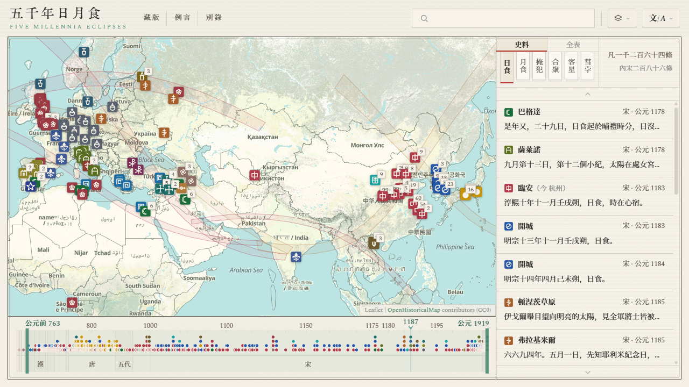

#  五千年日月食

[简体中文](../zh-Hans/README.md) · **繁體中文** · [English](../en/README.md) · [Français](../fr/README.md) · [Español](../es/README.md) · [Italiano](../it/README.md) · [日本語](../ja/README.md)

  

**網站鏈接**：<https://higashimado.github.io/FiveMillenniaEclipses/>

五千年日月食是取各代天象之記載，歸其所記之日、所記之地編成的歷史天文圖志。其以日食、月食為核心，兼收掩犯、合聚、客星、彗孛，共六類天象，現收萬餘條。凡可考之記錄，皆繫於以今法反推之實際事件，並列於橫跨五千年之歷軸上。無論古今中外，何人見之，何地見之，以何曆紀其日，以何名目當之，一目瞭然。

## 史籍

本站現收各類天象史籍共 12 026 條。每條分存原文、譯文與註解，原始文件見於 [data/](../data/) 目錄：

| 文件 | 內容 |
|---|---|
| [`data/records/schema.json`](../data/records/schema.json) | 字段定義 |
| [`data/records/manifest.json`](../data/records/manifest.json) | 文件清單 |
| [`data/records/sources.json`](../data/records/sources.json) | 來源目錄 |
| `data/records/<現象>/<文明>.jsonl` | 記錄本體 |

### 東亞

東亞記錄 11 804 共條，佔全庫 98.2%，年代自公元前 2137 年迄於 1911 年。有中國一支，涉二十四史中十六部及《清史稿》，取其天文、五行、律歷諸志與本紀。別有經部之《尚書》《詩經》[《春秋》](https://zh.wikisource.org/wiki/春秋經)[《左傳》](https://zh.wikisource.org/wiki/春秋左氏傳)、殷墟甲骨，日本、韓國、越南史料，及筆記詩文若干。文本多據 [維基文庫](https://zh.wikisource.org/) 之校點本。

主幹來源二十三種，合 11 666 條，佔東亞一支之 98.8%，按所記年代先後為序：

| 來源 | 年代 | 日 | 月 | 掩 | 合 | 客 | 彗 | 條數 |
|---|---|---:|---:|---:|---:|---:|---:|---:|
| [《漢書·五行志》](https://zh.wikisource.org/wiki/%E6%BC%A2%E6%9B%B8/%E5%8D%B7027)| 前 205 – 2 | 45 | | | | | | 45 |
| [《三國史記》](https://zh.wikisource.org/wiki/%E4%B8%89%E5%9C%8B%E5%8F%B2%E8%A8%98/%E5%8D%B701)| 前 54 – 911 | 44 | | | | 3 | 7 | 54 |
| [《後漢書·五行志六》](https://zh.wikisource.org/wiki/%E5%BE%8C%E6%BC%A2%E6%9B%B8/%E5%8D%B7108)| 26 – 219 | 65 | | | | | | 65 |
| [《後漢書·天文志》](https://zh.wikisource.org/wiki/%E5%BE%8C%E6%BC%A2%E6%9B%B8/%E5%8D%B7102)| 55 – 213 | 1 | | | | 11 | 17 | 29 |
| [《宋書·五行志》](https://zh.wikisource.org/wiki/%E5%AE%8B%E6%9B%B8/%E5%8D%B734)| 221 – 479 | 73 | | | | | | 73 |
| [《晉書·天文志》](https://zh.wikisource.org/wiki/%E6%99%89%E6%9B%B8/%E5%8D%B7013)| 222 – 418 | | 1 | | | 6 | 47 | 54 |
| [《魏書·天象志》](https://zh.wikisource.org/wiki/%E9%AD%8F%E6%9B%B8/%E5%8D%B7105%E4%B9%8B%E4%B8%80)| 400 – 549 | 32 | 36 | | | 3 | 23 | 94 |
| [《隋書·天文志》](https://zh.wikisource.org/wiki/%E9%9A%8B%E6%9B%B8/%E5%8D%B721)| 502 – 617 | 11 | 3 | 175 | 12 | 4 | 14 | 219 |
| [《新唐書·天文志》](https://zh.wikisource.org/wiki/%E6%96%B0%E5%94%90%E6%9B%B8/%E5%8D%B7033)| 618 – 906 | 90 | | 389 | 1 | 6 | 48 | 534 |
| [《舊唐書·天文志》](https://zh.wikisource.org/wiki/%E8%88%8A%E5%94%90%E6%9B%B8/%E5%8D%B736)| 626 – 839 | 1 | 1 | | | | 18 | 20 |
| [六國史](https://zh.wikisource.org/wiki/%E6%97%A5%E6%9C%AC%E6%9B%B8%E7%B4%80/%E5%8D%B7%E7%AC%AC%E4%B8%89%E5%8D%81) | 680 – 887 | 97 | 4 | | | | | 101 |
| [《扶桑略記》](https://zh.wikisource.org/wiki/%E6%89%B6%E6%A1%91%E7%95%A5%E8%A8%98/%E7%AC%AC023)《百鍊抄》《吾妻鏡》| 898 – 1265 | 20 | | | | | | 20 |
| [《舊五代史·天文志》](https://zh.wikisource.org/wiki/%E8%88%8A%E4%BA%94%E4%BB%A3%E5%8F%B2/%E5%8D%B7139)| 911 – 958 | 9 | 11 | | | | 6 | 26 |
| [《宋史·天文志》](https://zh.wikisource.org/wiki/%E5%AE%8B%E5%8F%B2/%E5%8D%B7053)| 960 – 1275 | 121 | 149 | 4 819 | | 17 | 21 | 5 127 |
| [《大越史記全書》](https://zh.wikisource.org/wiki/%E5%A4%A7%E8%B6%8A%E5%8F%B2%E8%A8%98%E5%85%A8%E6%9B%B8/%E6%9C%AC%E7%B4%80%E5%8D%B7%E4%B9%8B%E4%BA%94)| 993 – 1774 | 46 | 32 | | | | | 78 |
| [《高麗史·天文志》](https://zh.wikisource.org/wiki/%E9%AB%98%E9%BA%97%E5%8F%B2/%E5%8D%B7%E5%9B%9B%E5%8D%81%E5%85%AB)| 1012 – 1393 | 119 | 97 | 1 911 | 4 | 3 | 15 | 2 149 |
| [《金史·天文志》](https://zh.wikisource.org/wiki/%E9%87%91%E5%8F%B2/%E5%8D%B720)| 1120 – 1232 | 8 | 25 | 209 | 4 | 2 | 5 | 253 |
| [《元史·天文志》](https://zh.wikisource.org/wiki/%E5%85%83%E5%8F%B2/%E5%8D%B7049)| 1264 – 1367 | 35 | | 571 | 8 | 1 | 18 | 633 |
| [《明史·天文志》](https://zh.wikisource.org/wiki/%E6%98%8E%E5%8F%B2/%E5%8D%B726)| 1368 – 1642 | | | 972 | 45 | | 38 | 1 055 |
| [《明史·本紀》](https://zh.wikisource.org/wiki/%E6%98%8E%E5%8F%B2/%E5%8D%B72)| 1371 – 1643 | 75 | | | | | | 75 |
| [《朝鮮王朝實錄》](https://zh.wikisource.org/wiki/%E6%9C%9D%E9%AE%AE%E7%8E%8B%E6%9C%9D%E5%AF%A6%E9%8C%84/%E5%93%B2%E5%AE%97%E5%AF%A6%E9%8C%84/%E5%8D%81%E4%BA%8C%E5%B9%B4)| 1400 – 1863 | 84 | 32 | | | 84 | 297 | 497 |
| [《清史稿·天文志》](https://zh.wikisource.org/wiki/%E6%B8%85%E5%8F%B2%E7%A8%BF/%E5%8D%B737)| 1618 – 1796 | 50 | | 357 | | | 25 | 432 |
| [《清史稿·本紀》](https://zh.wikisource.org/wiki/%E6%B8%85%E5%8F%B2%E7%A8%BF/%E5%8D%B716)| 1646 – 1911 | 33 | | | | | | 33 |

其餘二十七種、138 條，含[《尚書·胤征》](https://zh.wikisource.org/wiki/尚書/胤征)之仲康日食、殷墟甲骨、[《詩經·小雅·十月之交》](https://zh.wikisource.org/wiki/詩經/十月之交)、盧仝[《月蝕詩》](https://zh.wikisource.org/wiki/全唐詩/卷388)與韓愈[《月蝕詩效玉川子作》](https://zh.wikisource.org/wiki/全唐詩/卷340)、[《遼史》](https://zh.wikisource.org/wiki/%E9%81%BC%E5%8F%B2/%E5%8D%B722)、藤原定家《明月記》、[《西夏書事》](https://zh.wikisource.org/wiki/%E8%A5%BF%E5%A4%8F%E6%9B%B8%E4%BA%8B/29)、[《長春真人西遊記》](https://zh.wikisource.org/wiki/%E9%95%B7%E6%98%A5%E7%9C%9F%E4%BA%BA%E8%A5%BF%E9%81%8A%E8%A8%98/%E5%8D%B7%E4%B8%8A)、[《續資治通鑑》](https://zh.wikisource.org/wiki/續資治通鑑)、舒嶽祥《日食》詩等。

### 其他

東亞以外 222 條，涉 21 個文明，其非設官連續記注，而以單點見證為主。中世紀以前所據者為編年、史著、抄本與泥板。十七世紀以後，則不復有「書」，代之以天文臺報告、學會通訊與私人書信。下表兼列典籍與觀測者。

| 文明 | 年代 | 典籍與報告 | 日 | 月 | 條數 |
|---|---|---|---:|---:|---:|
| 阿拉伯 | 829 – 1226 | [Ḥabash al-Ḥāsib](https://gallica.bnf.fr/ark:/12148/bpt6k5626201z)、[al-Māhānī](https://gallica.bnf.fr/ark:/12148/bpt6k5626201z)、al-Battānī、[Ibn Amājūr](https://gallica.bnf.fr/ark:/12148/bpt6k5626201z)、[Ibn Yūnus](https://gallica.bnf.fr/ark:/12148/bpt6k5626201z)、[al-Bīrūnī](https://archive.org/details/chronologyofanci00biru)、Ibn al-Athīr[《歷史大全》](https://archive.org/details/kamil-Tornberg)、[Ibn ʿIdhārī](https://archive.org/details/bub_gb_MiyHAAAAMAAJ) | 19 | 27 | 46 |
| 不列顛 | 664 – 1919 | 比德[《英吉利教會史》](https://www.gutenberg.org/cache/epub/38326/pg38326-images.html)、[《盎格魯-撒克遜編年史》](https://en.wikisource.org/wiki/Anglo-Saxon_Chronicle)、伍斯特的約翰[《編年紀事》](https://archive.org/details/florentiiwigorn00florgoog)、馬姆斯伯裡的威廉[《新近史》](https://archive.org/details/stubdegestisregumanglorum1)、亨廷登的亨利[《英吉利史》](https://archive.org/details/henriciarchidia00unkngoog)、坎特伯雷的傑維斯[《編年史》](https://archive.org/details/thehistoricalworksofgerva1)、馬修·帕里斯[《大編年史》](https://archive.org/details/matthiparisiensi03pari)、沃爾辛厄姆[《英吉利史》](https://archive.org/details/thomaewalsingham01wals)、鮑爾[《蘇格蘭紀年》](https://archive.org/details/scotichronicon-v-1-bks-1-2)、John Lamont、John Nicoll、[Alice Thornton](https://archive.org/details/autobiographyofm00thor)、[John Evelyn](https://archive.org/details/in.ernet.dli.2015.272771)、[Halley](https://archive.org/details/bim_eighteenth-century_a-description-of-the-pas_halley-edmund_1715_0)、[Baily](https://archive.org/details/paper-doi-10_1093_mnras_4_2_15)、[De la Rue](https://archive.org/details/ontotalsolarecli00dela)、[Lockyer](https://archive.org/details/contributionsto00lockgoog)、Copeland、[Dyson](https://archive.org/details/philtrans06337895)、Eddington | 31 | 8 | 39 |
| 神聖羅馬 | 806 – 1852 | [《法蘭克王家年代記》](https://thelatinlibrary.com/annalesregnifrancorum.html)、[《貝爾廷編年史》](https://archive.org/stream/annalesbertinian00wait/annalesbertinian00wait_djvu.txt)、[《希爾德斯海姆年代記》](https://www.dmgh.de/mgh_ss_3/index.htm)、[《馬爾巴赫年代記》](https://www.dmgh.de/mgh_ss_rer_germ_9/index.htm)、[Annalista Saxo](https://www.dmgh.de/mgh_ss_6/index.htm)、普呂姆的雷吉諾[《編年史》](https://www.dmgh.de/mgh_ss_rer_germ_50/)、讓布盧的西格貝特[《編年史》](https://www.dmgh.de/mgh_ss_6/index.htm)、齊陶的彼得[《茲布拉斯拉夫編年史》](https://archive.org/details/fontesrerumbohem04emle)、布熱佐瓦的瓦夫日涅茨[《胡斯派編年史》](https://archive.org/details/fontesrerumbohe00goog)、[Gemma Frisius](https://archive.org/details/gemmaefrisiimedi00gemm)、David Fabricius、開普勒[《對維特洛的補遺》](https://archive.org/details/advitellionempar00kepl)、[《論新星》](https://archive.org/details/10873675bsb)、Heinsius、Rümker、Busch、Galle、d'Arrest、Wolf、Klinkerfues | 12 | 16 | 28 |
| 美利堅 | 1806 – 1918 | [Ferrer](https://archive.org/details/jstor-1004811)、瑪麗亞·米切爾、Harkness、Gilman、Rogers、Young、Lockett、Willson、Seagrave、[Campbell](https://archive.org/details/jstor-984400)、Hammond、Adams、[Stebbins](https://archive.org/details/jstor-984404)、Morehouse、Pettit | 19 | 0 | 19 |
| 巴比倫 | 前 1223 – 前 183 | [《巴比倫天文日誌》](http://oracc.museum.upenn.edu/adsd/)、托勒密[《至大論》](https://archive.org/details/bub_gb_a9nvvbG-OOIC)、泥板 [BM 33066](https://cdli.earth/search?q=BM+33066)、烏加里特泥板 [KTU 1.78](https://cdli.earth/search?q=RS+12.061) | 1 | 11 | 12 |
| 意大利 | 1178 – 1852 | 薩萊諾的羅慕鐸[《編年史》](https://www.dmgh.de/mgh_ss_19/)、阿雷佐的里斯託羅[《世界的構成》](https://archive.org/details/lacomposizionedelmondo)、薩林貝內[《紀年》](https://www.dmgh.de/mgh_ss_32/index.htm)、[《皮亞琴察吉伯林黨年代記》](https://www.dmgh.de/mgh_ss_18/)、[《弗利編年史》](https://archive.org/details/rerumitalicarums271mura)、巴爾巴羅[《君士坦丁堡圍城日記》](https://vec.wikisource.org/wiki/Giornale_dell%27assedio_di_Costantinopoli_1453)、坎特伯雷的傑維斯[《編年史》](https://archive.org/details/thehistoricalworksofgerva1)、[克拉維烏斯](https://archive.org/details/christophoriclau00clav_1)、開普勒[《論新星》](https://archive.org/details/10873675bsb)、塞奇 | 8 | 4 | 12 |
| 敘利亞 | 512 – 1191 | 米海爾一世[《編年史》](https://archive.org/details/chroniquedemiche01mich) | 9 | 2 | 11 |
| 法蘭西 | 1033 – 1905 | 拉烏爾·格拉貝爾[《歷史五書》](https://archive.org/details/rodulfiglabrihis0000glab)、托里尼的羅貝爾[《編年史》](https://www.dmgh.de/mgh_ss_6/index.htm)、[《蒙彼利埃小塔拉姆》](https://archive.org/details/thalamusparvusmontpellierma)、聖德尼修士[《查理六世紀年》](https://gallica.bnf.fr/ark:/12148/bpt6k6224315z)、Maraldi、Cassini、Janssen、Lescarbault、Štefánik | 8 | 2 | 10 |
| 伊比利亞 | 939 – 1560 | [《卡斯蒂利亞古年代記》](https://archive.org/details/espanasagradathe23flor)、[《托萊多第一年代記》](https://archive.org/details/espanasagradathe23flor)、[《塞拉託編年史》](https://archive.org/details/espanasagradathe23flor)、[《科英布拉編年史》](https://archive.org/details/portugaliaemonumentahistoricascrv1)、貝爾納爾德斯[《天主教雙王紀》](https://archive.org/details/historiadelosrey00bern)、斐迪南·哥倫布 *Historie*、[克拉維烏斯](https://archive.org/details/christophoriclau00clav_1) | 7 | 1 | 8 |
| 亞美尼亞 | 1099 – 1736 | [埃德薩的馬修](https://archive.org/details/bub_gb_YlkuAAAAQAAJ)、[格里高利神父](https://archive.org/details/bub_gb_YlkuAAAAQAAJ)、阿尼的薩穆埃爾[《年表》](https://archive.org/details/collectiondhist00arhagoog)、[大不里士的阿拉克爾](https://archive.org/details/collectiondhist00arhagoog)、[克里特的亞伯拉罕](https://archive.org/details/collectiondhist00arhagoog) | 4 | 3 | 7 |
| 希臘 | 前 648 – 71 | 阿爾基洛科斯[《殘篇》](https://www.perseus.tufts.edu/hopper/text?doc=Perseus:text:1999.01.0060:bekker+page=1418b)、希羅多德[《歷史》](https://www.perseus.tufts.edu/hopper/text?doc=Perseus:text:1999.01.0126:book=1:chapter=74)、修昔底德[《伯羅奔尼撒戰爭史》](https://en.wikisource.org/wiki/History_of_the_Peloponnesian_War/Book_7)、狄奧多羅斯[《歷史叢書》](https://penelope.uchicago.edu/Thayer/E/Roman/Texts/Diodorus_Siculus/20A*.html)、帕普斯[《至大論注》](https://archive.nyu.edu/bitstream/2451/61288/56/11.%20Carman.pdf)、普魯塔克[《論月面》](https://penelope.uchicago.edu/Thayer/E/Roman/Texts/Plutarch/Moralia/The_Face_in_the_Moon*/home.html) | 6 | 1 | 7 |
| 北歐 | 1030 – 1581 | 斯諾里[《奧拉夫聖王傳》](https://www.gutenberg.org/files/598/598-h/598-h.htm)、斯圖拉[《哈康松傳》](https://archive.org/details/icelandicsagasot02stur)、第谷 [*Astronomiae Instauratae Progymnasmata*](https://archive.org/details/bub_gb_CVOItHLenPEC)、[伽桑狄](https://archive.org/details/den-kbd-pil-130018157889-001) | 3 | 2 | 5 |
| 斯拉夫 | 1185 – 1406 | [《伊帕提耶夫編年史》](https://archive.org/details/Complete_Collection_of_Russian_Chronicles_1923_Vol_2_Hypatian_Chronicle)、[《勞倫特編年史》](https://archive.org/details/Complete_Collection_of_Russian_Chronicles_1926_Vol_1_Laurentian_Chronicle)、[《諾夫哥羅德第一編年史》](https://archive.org/details/chronicleofnovgo00michrich)、[《揚科編年史》](https://archive.org/details/monumentapoloni00bielgoog) | 4 | 0 | 4 |
| 拜占庭 | 968 – 1453 | 利奧執事[《歷史》](https://archive.org/details/corpusscriptoru12unkngoog)、[安娜·科穆寧娜](https://en.wikisource.org/wiki/The_Alexiad)、偽斯弗朗齊斯《大編年史》 | 2 | 1 | 3 |
| 俄羅斯 | 1748 – 1791 | Braun、Popov、Rumovsky、Inochodzov | 3 | 0 | 3 |
| 羅馬 | 前 190 – 前 168 | 李維[《建城以來》](https://www.thelatinlibrary.com/livy/liv.37.shtml)、普魯塔克[《埃米利烏斯·保盧斯傳》](https://penelope.uchicago.edu/Thayer/E/Roman/Texts/Plutarch/Lives/Aemilius*.html) | 1 | 1 | 2 |
| 瑪雅 | 755 · 859 | [《德累斯頓抄本》](https://www.famsi.org/mayawriting/codices/dresden.html) | 2 | 0 | 2 |
| 赫梯 | 前 1312 | 《穆爾西里二世年代記》 | 1 | 0 | 1 |
| 亞述 | 前 763 | [《名年官表》](https://oracc.museum.upenn.edu/saao/saas2/) | 1 | 0 | 1 |
| 阿茲特克 | 1496 | 《特列里亞諾-雷門西斯古抄本》 | 1 | 0 | 1 |
| 拉丁美洲 | 1923 | Joaquín Gallo | 1 | 0 | 1 |

## 全表

本站日月食全表的計算引擎同 [星下點地圖](https://github.com/Higashimado/SubstellarAtlas)，而日月食元素多取自 NASA/Espenak 之五千年正典（[5MCSE / 5MCLE](https://eclipse.gsfc.nasa.gov/)），計日食 9 506 次、月食 9 650 次。正典起於天文年 −1999，即公元前 2000 年；更早一段無典可依，貝塞爾元素改由 [JPL DE441](https://ssd.jpl.nasa.gov/planets/eph_export.html) 星曆自算，計日食 2 365 次、月食 2 381 次，另附經度中誤差一項，其值在 4.48° 與 7.30° 之間。

**目錄結構**

| 文件 | 內容 | 體量 |
|---|---|---|
| [`data/eclipses/solar.json`](../data/eclipses/solar.json) | 日食索引 | 11 871 條 · 9.1 MB |
| [`data/eclipses/lunar.json`](../data/eclipses/lunar.json) | 月食索引 | 12 031 條 · 9.3 MB |
| [`data/eclipses/events/`](../data/eclipses/events/) `<date>.json` |接觸曲線與貝塞爾多項式 | 11 871 個 · 219 MB |
| [`data/eclipses/bessel-5mcse.json`](../data/eclipses/bessel-5mcse.json) | NASA 5MCSE 元素 | 9 506 條 |

## 對照

本站以六份對照表索引史籍所記之地點、時間與對象，為史籍與全表相聯之據。

**目錄結構**

| 文件 | 內容 | 條目 |
|---|---|---:|
| [`data/duizhao/xingguan.json`](../data/duizhao/xingguan.json) | 天文對象 | 391 |
| [`data/duizhao/nianhao.json`](../data/duizhao/nianhao.json) | 中國年號（前 140 – 1911）| 330 |
| [`data/duizhao/nengo.json`](../data/duizhao/nengo.json) | 日本元號（645 – 今）| 241 |
| [`data/duizhao/diming.json`](../data/duizhao/diming.json) | 觀測地點 | 164 |
| [`data/duizhao/wenming.json`](../data/duizhao/wenming.json) | 文明身份 | 28 |
| [`data/duizhao/quyu.json`](../data/duizhao/quyu.json) | 地理區域 | 124 |

## 致謝與許可

本項目自有代碼以 [**GNU General Public License v3.0**](../LICENSE) 發佈；[`data/records/`](../data/records/README.md) 與 [`data/duizhao/`](../data/duizhao/README.md) 以 [**CC-BY-SA 4.0**](https://creativecommons.org/licenses/by-sa/4.0/) 發佈；第三方代碼、數據、字體依其各自之許可。

| 用途 | 組件 (版本) | 作者 / 來源 | 許可 |
|---|---|---|---|
| 影錐幾何 | [SubstellarAtlas](https://github.com/Higashimado/SubstellarAtlas) | Higashimado | GPL-3.0 |
| 地圖引擎 | [Leaflet](https://leafletjs.com/) 1.9.4 | Volodymyr Agafonkin | BSD-2-Clause |
| 矢量渲染 | [MapLibre GL JS](https://maplibre.org/) 5.24.0 | MapLibre | BSD-3-Clause |
| 圖層橋接 | [maplibre-gl-leaflet](https://github.com/maplibre/maplibre-gl-leaflet) 0.1.3 | MapLibre | ISC |
| 時間過濾 | [maplibre-gl-dates](https://github.com/OpenHistoricalMap/maplibre-gl-dates) 1.3.0 | OpenHistoricalMap | ISC |
| 天文計算 | [Astronomy Engine](https://github.com/cosinekitty/astronomy) 2.1.19 | Don Cross | MIT |
| 日月食正典 | [5MCSE / 5MCLE](https://eclipse.gsfc.nasa.gov/) | Fred Espenak（NASA GSFC）| 公有領域 + 署名 |
| 古代星曆 | [JPL DE441](https://ssd.jpl.nasa.gov/planets/eph_export.html) | JPL | 公有領域 |
| 地球自轉 | [Stephenson, Morrison & Hohenkerk 2016](https://doi.org/10.1098/rspa.2016.0404) | Royal Society | CC BY-SA 4.0 |
| 歷史底圖 | [OpenHistoricalMap](https://www.openhistoricalmap.org/) | OHM 社區 | 數據 CC0 |
| 現代底圖 | [CARTO](https://carto.com/) Positron · Voyager | CARTO | © CARTO |
| 現代底圖 | [OpenStreetMap](https://www.openstreetmap.org/) 標準圖層 | OSM 貢獻者 | ODbL |
| 地形底圖 | [Esri World Shaded Relief](https://www.esri.com/) | Esri / USGS | © Esri |
| 底圖數據 | [OpenStreetMap](https://www.openstreetmap.org/copyright) | OSM 貢獻者 | ODbL |
| 正史文本 | [維基文庫](https://zh.wikisource.org/) | Wikisource 貢獻者 | CC-BY-SA 4.0 |
| CJK 字體 | [Source Han Serif](https://github.com/adobe-fonts/source-han-serif) 思源宋體 | Adobe | OFL |
| 西文字體 | [Spectral](https://fonts.google.com/specimen/Spectral) | Production Type | OFL |
| 多文字襯線 | [Noto Serif](https://fonts.google.com/noto) · Naskh Arabic · Serif Armenian · Serif Hebrew | Google | OFL |
| 題銘字體 | [KingHwaOldSong](https://fonts.zeoseven.com/) 京華老宋體 | ZeoSeven Fonts | 見 [licenses](../licenses/) |

五千年之事，浩如煙海，疏漏舛誤所不能免。同好如有可補之史料、可正之錯訛、可申之考證，望於 [issues](https://github.com/Higashimado/FiveMillenniaEclipses/issues) 見告，不勝感激。
